# 第六课：简易 HTTP 服务器 —— select + HTTP 协议实战

> 用第五课的 select 多路复用框架，加上 HTTP 协议知识，手写一个能被浏览器访问的静态文件服务器。

---

## 一、整体目标

用浏览器访问 `http://<服务器IP>:8888`，看到服务器从磁盘读取的网页。核心新知识：HTTP 请求解析 + HTTP 响应构造 + C 文件 I/O。

### 和聊天室的区别

| | 聊天室 | HTTP 服务器 |
|------|--------|-------------|
| 收到消息后 | 广播给所有人 | 解析 HTTP 请求 |
| 发送什么 | 原样转发 | 构造 HTTP 响应 |
| 连接生命周期 | 长连接（一直保持） | 短连接（响应完就关） |
| 端口 | 9999 | 8888 |
| 缓冲区 | 1024 字节 | 4096 字节 |

**前六步完全一样：** `socket → setsockopt → bind → listen → select → accept → recv`。recv 拿到数据之后的处理逻辑才是 HTTP 的特色。

---

## 二、头文件说明

```cpp
#include <iostream>      // std::cout / std::endl
#include <cstring>       // strlen / strcmp / strcpy / strrchr
#include <vector>        // std::vector 动态客户端列表
#include <sys/socket.h>  // socket / bind / listen / accept / send / recv / AF_INET / SOCK_STREAM
#include <netinet/in.h>  // sockaddr_in / htons / INADDR_ANY
#include <sys/select.h>  // fd_set / FD_ZERO / FD_SET / FD_ISSET / select
#include <unistd.h>      // close
#include <string>        // std::string / std::to_string（🆕 本课新增）
#include <cstdio>        // fopen / fread / fseek / ftell / fclose（🆕 本课新增）
```

### 为什么用 `<cstdio>` 而不是 `<fstream>`

HTTP 响应要求 **Content-Length 写在正文前面**，必须先知道文件大小。C 的做法简洁直观：

```cpp
fseek(fp, 0, SEEK_END);   // 跳到末尾
long size = ftell(fp);     // 拿位置 → 即文件字节数
rewind(fp);                // 回到开头
```

C++ `<fstream>` 也能做同样的事（`seekg` + `tellg`），但代码更长。且 `socket`、`send`、`recv`、`strcmp` 已是 C 风格，统一用 C I/O 更协调。

---

## 三、服务器初始化（前六步）

```cpp
int server_fd = socket(AF_INET, SOCK_STREAM, 0);

int opt = 1;
setsockopt(server_fd, SOL_SOCKET, SO_REUSEADDR, &opt, sizeof(opt));

sockaddr_in addr{};
addr.sin_family = AF_INET;             // IPv4
addr.sin_addr.s_addr = INADDR_ANY;     // 监听本机所有IP（0.0.0.0）
addr.sin_port = htons(8888);           // 端口号
bind(server_fd, (sockaddr*)&addr, sizeof(addr));
listen(server_fd, 10);                 // 排队上限 10

std::vector<int> clients;              // 花名册
```

| 步骤 | 函数 | 作用 | 类比 |
|------|------|------|------|
| 1 | `socket()` | 创建 socket | 买一部电话 |
| 2 | `setsockopt()` | 端口重用 | 挂断后立即可再打 |
| 3 | `bind()` | 绑定地址和端口 | 把电话线插墙上 |
| 4 | `listen()` | 开始监听 | 话务员就位 |
| 5 | `select()` | 同时盯多个 fd（循环中） | 等任意电话响 |
| 6 | `accept()` | 接新连接（循环中） | 接起电话 |

---

## 四、select 循环 + accept

```cpp
while (true) {
    fd_set read_fds;
    FD_ZERO(&read_fds);           // ① 全部清零
    FD_SET(server_fd, &read_fds); // ② 把 server_fd 设为"盯住"
    int max_fd = server_fd;

    for (int fd : clients) {      // ③ 每个客户端也盯住
        FD_SET(fd, &read_fds);
        if (fd > max_fd) max_fd = fd;
    }

    select(max_fd + 1, &read_fds, nullptr, nullptr, nullptr);  // ④ 睡觉等

    if (FD_ISSET(server_fd, &read_fds)) {                      // ⑤ 有人敲门？
        int client_fd = accept(server_fd, nullptr, nullptr);
        clients.push_back(client_fd);
    }
```

### 为什么每轮循环必须重建 fd_set

select 返回后会**修改 bitmap**：只有"有动静"的 fd 保留 1，其他全清零。下一轮循环如果不重建，没动静的 fd 就再也不会被监控了。

```
select 前：fd=3=1, fd=4=1, fd=5=1  ← "盯着这三个"
    ↓ select()
select 后：fd=3=0, fd=4=1, fd=5=0  ← "只有 fd=4 有消息"

下一轮必须重新 FD_SET，否则 fd=3 和 fd=5 就丢了！
```

### `max_fd` 的作用

告诉内核"只扫描 fd 0 ~ max_fd"。纯性能优化，和功能逻辑无关。

---

## 五、解析 HTTP 请求行（🆕 核心新知识）

### 收到的原始数据

浏览器发来的是一坨纯文本：

```
GET /index.html HTTP/1.1\r\n
Host: 192.168.31.2:8888\r\n
Connection: keep-alive\r\n
User-Agent: Mozilla/5.0\r\n
\r\n
```

### 用指针提取路径

```cpp
char* path = buf;
while (*path != ' ' && *path != '\0') path++;  // ① 跳过 "GET"，走到第一个空格
path++;                                          // ② 跳过空格，站到 '/' 位置
char* end = path;
while (*end != ' ' && *end != '\0') end++;       // ③ 从 '/' 出发，走到第二个空格
*end = '\0';                                     // ④ 截断！path 现在是纯路径
```

### 指针移动可视化

> 下图循环播放指针扫描请求行的完整过程：path 先跳过 `GET` → 站到 `/` → end 从 `/` 出发找到第二个空格 → 写入 `\0` 截断。



> 💡 如果上图静止不播放，[点此在新窗口打开动画](demo/pointer-animation.svg)（循环播放，6 秒/周期）。

**没有复制新字符串，没有分配新内存。** 就是在原地插了 `\0`，path 指向中间。这就是 C 风格字符串操作的高效之处。

### 指针符号速查

| 表达式 | 含义 |
|--------|------|
| `*path` | 当前指向的字符 |
| `path++` | 指针往后移一个字节 |
| `*path != ' '` | 当前字符不是空格就继续走 |
| `*end = '\0'` | 在当前位置写入字符串结束符 |

---

## 六、路径映射 + 读文件（🆕 核心新知识）

### 第一步：路径映射

```cpp
char filepath[512];
if (strcmp(path, "/") == 0) {
    strcpy(filepath, "www/index.html");   // 首页
} else {
    snprintf(filepath, sizeof(filepath), "www%s", path);
}
```

| 浏览器请求 | 映射到的本地文件 |
|-----------|----------------|
| `/` | `www/index.html` |
| `/hello.html` | `www/hello.html` |
| `/css/style.css` | `www/css/style.css` |

### 第二步：C 文件 I/O 四步曲

```cpp
FILE* fp = fopen(filepath, "rb");  // rb = 二进制只读
```

| 参数 | 含义 |
|------|------|
| `"r"` | 只读 |
| `"rb"` | 只读 + 二进制模式。加 `b` 防止图片等二进制文件被行尾转换破坏 |

```cpp
fseek(fp, 0, SEEK_END);   // 跳到文件末尾
long size = ftell(fp);     // 当前字节位置 = 文件大小
rewind(fp);                // 回到文件开头

std::string body(size, '\0');   // 预留 size 字节
fread(&body[0], 1, size, fp);   // 一次读入全部内容
fclose(fp);                     // 关闭文件
```

**fseek + ftell + rewind 流程：**

```
文件：[H][T][M][L][.]
位置： 0  1  2  3  4  5

fseek(fp, 0, SEEK_END) → 位置跳到 5
ftell(fp) → 5           → 拿到文件大小
rewind(fp) → 位置回到 0  → 准备读
```

### 第三步：后缀 → Content-Type 映射

```cpp
const char* ext = strrchr(filepath, '.');    // 从右往左找 '.'
```

`strrchr`（string reverse char）：**从右往左**找第一个匹配字符。

```
filepath = "www/style.min.css"

strchr  (从左往右) → ".style.min.css"  ❌
strrchr (从右往左) → ".css"           ✅
```

```cpp
if (strcmp(ext, ".html") == 0)      content_type = "text/html; charset=utf-8";
else if (strcmp(ext, ".css") == 0)  content_type = "text/css; charset=utf-8";
else if (strcmp(ext, ".js") == 0)   content_type = "application/javascript";
else if (strcmp(ext, ".png") == 0)  content_type = "image/png";
else if (strcmp(ext, ".jpg") == 0)  content_type = "image/jpeg";
else if (strcmp(ext, ".txt") == 0)  content_type = "text/plain; charset=utf-8";
else                                 content_type = "application/octet-stream";
```

`application/octet-stream` = 默认值，未知类型当二进制处理。

### 关于 `charset=utf-8`

文件用 UTF-8 编码，`Content-Type` 带 `charset=utf-8`，浏览器就不会猜错编码。之前出现的"网页乱码终端正常"或反之，就是因为缺少这个声明。

---

## 七、构造 HTTP 响应（🆕 核心新知识）

### 响应格式（死格式）

```
状态行\r\n           ← HTTP/1.1 200 OK
头部1\r\n            ← Content-Type: text/html; charset=utf-8
头部2\r\n            ← Content-Length: 230
\r\n                 ← 空行（头体分隔符，必须有！）
正文                 ← 文件内容或错误信息
```

### 404 分支：文件不存在

```cpp
const char* body = "<h1>404 Not Found</h1>";
response = "HTTP/1.1 404 Not Found\r\n"
           "Content-Type: text/html; charset=utf-8\r\n"
           "Content-Length: "
           + std::to_string(strlen(body)) + "\r\n"
           + "\r\n" + body;
```

### 200 分支：文件正常

```cpp
response = "HTTP/1.1 200 OK\r\n"
           "Content-Type: "
           + std::string(content_type) + "\r\n"
           + "Content-Length: " + std::to_string(size) + "\r\n"
           + "\r\n" + body;
```

### 关键细节

| 要求 | 原因 |
|------|------|
| 每行用 `\r\n` 结尾 | HTTP 协议规定，不能用 `\n` 替代 |
| `Content-Length` 必须精确 | 少 1 字节浏览器就会白屏，等着永远不会来的数据 |
| 空行 `\r\n` 不可省略 | 头体分隔符，没有它浏览器把正文当头部解析 |
| `std::to_string()` 动态算长度 | 每个文件大小不同，不能写死 |

---

## 八、请求生命周期

每个浏览器请求完整经过的七步：

```
accept → recv → 解析路径 → 读文件(或404) → send → close → erase
```

```
浏览器                 服务器                   文件系统
   │                     │
   ├─ TCP SYN ──────────→│ select醒 → accept
   │                     │
   ├─ GET / HTTP ───────→│ recv → 解析 → path="/"
   │                     │ filepath="www/index.html"
   │                     │                        ├─ fopen ✅
   │                     │                        ├─ fseek/ftell
   │                     │                        ├─ fread
   │                     │                        └─ fclose
   │                     │ 拼 200 响应
   │←─ 200 + HTML ──────│ send → close → erase
   │                     │
   │  渲染页面            │ select 继续等下一个人...
```

---

## 九、完整代码

```cpp
#include <iostream>
#include <cstring>
#include <vector>
#include <sys/socket.h>
#include <netinet/in.h>
#include <sys/select.h>
#include <unistd.h>
#include <string>
#include <cstdio>

int main() {
    int server_fd = socket(AF_INET, SOCK_STREAM, 0);

    int opt = 1;
    setsockopt(server_fd, SOL_SOCKET, SO_REUSEADDR, &opt, sizeof(opt));

    sockaddr_in addr{};
    addr.sin_family = AF_INET;
    addr.sin_addr.s_addr = INADDR_ANY;
    addr.sin_port = htons(8888);
    bind(server_fd, (sockaddr*)&addr, sizeof(addr));
    listen(server_fd, 10);

    std::cout << "[HTTP服务器] 监听0.0.0.0:8888\n";
    std::vector<int> clients;

    while (true) {
        fd_set read_fds;
        FD_ZERO(&read_fds);
        FD_SET(server_fd, &read_fds);
        int max_fd = server_fd;

        for (int fd : clients) {
            FD_SET(fd, &read_fds);
            if (fd > max_fd) max_fd = fd;
        }

        select(max_fd + 1, &read_fds, nullptr, nullptr, nullptr);

        if (FD_ISSET(server_fd, &read_fds)) {
            int client_fd = accept(server_fd, nullptr, nullptr);
            clients.push_back(client_fd);
            std::cout << "[HTTP] 新连接 fd=" << client_fd
                      << " (共" << clients.size() << "人在线)\n";
        }

        char buf[4096];
        for (auto it = clients.begin(); it != clients.end(); ) {
            int fd = *it;
            if (FD_ISSET(fd, &read_fds)) {
                int n = recv(fd, buf, sizeof(buf) - 1, 0);
                if (n <= 0) {
                    if (n == 0)
                        std::cout << "[HTTP] 连接断开 fd=" << fd << "\n";
                    close(fd);
                    it = clients.erase(it);
                    continue;
                }
                buf[n] = '\0';

                std::cout << "[HTTP] 收到请求:\n" << buf << std::endl;

                // 解析请求行: GET /path HTTP/1.1
                char* path = buf;
                while (*path != ' ' && *path != '\0') path++;
                path++;
                char* end = path;
                while (*end != ' ' && *end != '\0') end++;
                *end = '\0';

                std::cout << "[HTTP] 请求路径: " << path << "\n";

                // 映射到本地文件
                char filepath[512];
                if (strcmp(path, "/") == 0) {
                    strcpy(filepath, "www/index.html");
                } else {
                    snprintf(filepath, sizeof(filepath), "www%s", path);
                }

                // 尝试读文件
                FILE* fp = fopen(filepath, "rb");
                std::string response;

                if (fp == nullptr) {
                    const char* body = "<h1>404 Not Found</h1>";
                    response = "HTTP/1.1 404 Not Found\r\n"
                               "Content-Type: text/html; charset=utf-8\r\n"
                               "Content-Length: "
                               + std::to_string(strlen(body)) + "\r\n"
                               + "\r\n" + body;
                } else {
                    fseek(fp, 0, SEEK_END);
                    long size = ftell(fp);
                    rewind(fp);
                    std::string body(size, '\0');
                    fread(&body[0], 1, size, fp);
                    fclose(fp);

                    const char* content_type = "application/octet-stream";
                    const char* ext = strrchr(filepath, '.');
                    if (ext != nullptr) {
                        if (strcmp(ext, ".html") == 0)
                            content_type = "text/html; charset=utf-8";
                        else if (strcmp(ext, ".css") == 0)
                            content_type = "text/css; charset=utf-8";
                        else if (strcmp(ext, ".js") == 0)
                            content_type = "application/javascript";
                        else if (strcmp(ext, ".png") == 0)
                            content_type = "image/png";
                        else if (strcmp(ext, ".jpg") == 0)
                            content_type = "image/jpeg";
                        else if (strcmp(ext, ".txt") == 0)
                            content_type = "text/plain; charset=utf-8";
                    }

                    response = "HTTP/1.1 200 OK\r\n"
                               "Content-Type: "
                               + std::string(content_type) + "\r\n"
                               + "Content-Length: " + std::to_string(size) + "\r\n"
                               + "\r\n" + body;
                }

                send(fd, response.c_str(), response.size(), 0);
                close(fd);
                it = clients.erase(it);
                continue;
            }
            ++it;
        }
    }

    close(server_fd);
    return 0;
}
```

编译：`g++ -std=c++17 -o http_server http_server.cpp`

---

## 十、运行指南

### 准备工作

```bash
mkdir -p practical/demo/www
```

创建 `www/index.html`（测试首页）：

```html
<!DOCTYPE html>
<html>
<head><meta charset="utf-8"><title>测试页面</title></head>
<body>
  <h1>首页</h1>
  <p>如果你看到这行，说明服务器文件读取功能正常。</p>
  <p><a href="/hello.html">点我去 hello.html</a></p>
</body>
</html>
```

### 启动 + 测试

```bash
cd practical/demo && ./http_server
```

浏览器访问 `http://<服务器IP>:8888`。

> **注意：** 如果服务器跑在 WSL/虚拟机里，不能用 `localhost`，要用虚拟机的实际 IP（`ip addr` 查看）。

### 测试用例

| URL | 预期效果 |
|-----|---------|
| `/` | 显示 index.html 首页 |
| `/hello.html` | 显示 hello.html |
| `/nothing` | 显示 404 Not Found |

### 常见问题

**问题：浏览器加载不出来**

1. 检查：`ss -tlnp | grep 8888`
2. 杀掉僵尸进程：`killall http_server`
3. 确认用的是服务器实际 IP 而非 `localhost`

**问题：中文乱码**

文件编码必须为 UTF-8，且 `Content-Type` 带 `charset=utf-8`。

---

## 十一、优化版：五个维度升级

> 以下优化已全部实现，最终代码见第十二节。

---

### O1：路径穿越防护 —— `strstr(path, "..")` 拦截

**问题：** `GET /../../../etc/passwd` → `snprintf` 拼出 `www/../../../etc/passwd`，直接跳出 `www/` 目录读取任意系统文件。

**解决：** 解析完 path 后，检查是否包含 `..`，有就返回 403 Forbidden。

```cpp
// 🆕 O1：路径穿越防护
if (strstr(path, "..") != nullptr) {
    const char* body = "<h1>403 Forbidden</h1>";
    // 拼 403 响应 ...
    send(fd, response.c_str(), response.size(), 0);
    // keep-alive 判断 → close or not
    continue;
}
```

| 新函数 | 头文件 | 作用 |
|--------|--------|------|
| `strstr(haystack, needle)` | `<cstring>` | 在字符串里找子串，找到返回指针，找不到返回 `nullptr` |

---

### O2：sendfile 零拷贝 —— 用 `open` + `fstat` + `sendfile` 替代 C FILE*

**问题：** `fread → 用户态 body 字符串 → send`，数据从内核拷到用户态又拷回内核，500MB 文件白绕一圈。

**解决：** `sendfile(fd, file_fd, NULL, size)` 在内核态直接把文件灌到 TCP 连接。

```cpp
// 旧方案（7步）：
FILE* fp = fopen(filepath, "rb");
fseek → ftell → rewind → fread → fclose → 拼string → send

// 🆕 新方案（4步）：
int file_fd = open(filepath, O_RDONLY);    // Unix原生打开
struct stat st;
fstat(file_fd, &st);                        // 拿文件大小
send(fd, header, header_len, 0);           // 先发HTTP头
sendfile(fd, file_fd, nullptr, st.st_size); // 零拷贝发文件
close(file_fd);
```

| 新函数 | 头文件 | 作用 |
|--------|--------|------|
| `open(path, O_RDONLY)` | `<fcntl.h>` | Unix 原生打开文件，返回 `int` fd，失败返回 -1 |
| `fstat(fd, &st)` | `<sys/stat.h>` | 获取文件信息，`st.st_size` 是字节数 |
| `sendfile(sock, file, NULL, size)` | `<sys/sendfile.h>` | 内核态直接把文件灌入 socket |

**对比：**

| | C FILE* | Unix fd |
|------|---------|---------|
| 打开 | `FILE* fp = fopen(path, "rb")` | `int fd = open(path, O_RDONLY)` |
| 失败 | `fp == nullptr` | `fd == -1` |
| 大小 | `fseek → ftell → rewind`（3步） | `fstat`（1步） |
| 发送 | `fread → send`（2次拷贝） | `sendfile`（0次拷贝） |
| 关闭 | `fclose(fp)` | `close(fd)` |

---

### O3：错误区分 —— `errno` 细分 `recv` 返回值

**问题：** `recv < 0` 一律踢人，网络波动（EAGAIN）或被信号打断（EINTR）误杀正常连接。

**解决：** 用 `errno` 区分错误类型。

```cpp
if (n < 0) {
    if (errno == EAGAIN || errno == EWOULDBLOCK) {
        // 非阻塞 socket 暂时没数据，跳过
        ++it; continue;
    }
    if (errno == EINTR) {
        // 被信号打断，重试
        continue;
    }
    // 真错误：ECONNRESET、ETIMEDOUT → 踢人
    close(fd); it = clients.erase(it); continue;
}
```

| errno 值 | 含义 | 处理 |
|----------|------|------|
| `EAGAIN` / `EWOULDBLOCK` | 非阻塞 socket 暂时没数据可读 | 跳过，下次再试 |
| `EINTR` | 被操作系统信号打断 | 重试 recv |
| `ECONNRESET` | 对方异常重置连接 | 踢人 |
| `ETIMEDOUT` | 连接超时 | 踢人 |

> **`errno` 在 `<cerrno>` 里。** 系统调用（recv/send/open 等）返回 -1 时，内核把错误原因写进 `errno`。

---

### O4：非阻塞 I/O —— `fcntl` 设 `O_NONBLOCK`

**问题：** 默认阻塞模式，`send()` 在对方接收缓冲区满时卡住，整个 select 循环被拖死。

**解决：** `accept` 后立即设客户端 fd 为非阻塞模式。

```cpp
void set_nonblocking(int fd) {
    int flags = fcntl(fd, F_GETFL, 0);   // ① 读当前标志
    flags |= O_NONBLOCK;                  // ② 位或，置 NONBLOCK 位为 1
    fcntl(fd, F_SETFL, flags);           // ③ 写回去
}
```

```cpp
// accept 后调用
int client_fd = accept(server_fd, nullptr, nullptr);
set_nonblocking(client_fd);   // 🆕 设非阻塞
```

| 函数 | 参数 | 作用 |
|------|------|------|
| `fcntl(fd, F_GETFL, 0)` | `F_GETFL` = get flags | 读当前文件标志 |
| `fcntl(fd, F_SETFL, flags)` | `F_SETFL` = set flags | 写文件标志 |

`|= O_NONBLOCK`：`flags` 和 `O_NONBLOCK` 做位或，把 NONBLOCK 对应的 bit 置 1，其他 bit 不变。

> 只有非阻塞 socket 才会返回 `EAGAIN`——O3 和 O4 是互相配合的。

---

### O5：HTTP Keep-Alive —— TCP 连接复用

**问题：** 每个请求走完就 `close(fd)`。一个页面如果有 5 个资源（图片/CSS/JS），需要 5 次三次握手 + 四次挥手。

**解决：** 解析 `Connection: keep-alive` 头部，不复用就保持连接。

```cpp
// ① 解析 Connection 头部
bool keep_alive = false;
if (strstr(buf, "Connection: keep-alive") != nullptr) {
    keep_alive = true;
}

// ② send 后不直接 close，根据 keep_alive 决定
if (keep_alive) {
    // 不关连接，继续 select 等下次请求
    ++it;
} else {
    close(fd);
    it = clients.erase(it);
}
```

同时给 select 加 5 秒超时，防止空闲 keep-alive 连接永远占着 fd：

```cpp
struct timeval tv;
tv.tv_sec = 5;      // 秒
tv.tv_usec = 0;     // 微秒（1秒=1,000,000微秒）

select(max_fd + 1, &read_fds, nullptr, nullptr, &tv);
//                                   非nullptr ↑ = 5秒没人敲门就返回
```

| 字段 | 含义 |
|------|------|
| `tv_sec` | 秒 |
| `tv_usec` | 微秒 |

之前 `select` 第五个参数是 `nullptr` = 无限等；`&tv` = 超时返回。

---

## 十二、优化版完整代码

```cpp
#include <iostream>
#include <cstring>
#include <vector>
#include <sys/socket.h>
#include <netinet/in.h>
#include <sys/select.h>
#include <unistd.h>
#include <string>
#include <sys/sendfile.h>   // 🆕 sendfile
#include <cerrno>           // 🆕 errno
#include <fcntl.h>          // 🆕 open / fcntl / O_RDONLY / O_NONBLOCK
#include <sys/stat.h>       // 🆕 fstat

void set_nonblocking(int fd) {                     // 🆕 O4
    int flags = fcntl(fd, F_GETFL, 0);
    flags |= O_NONBLOCK;
    fcntl(fd, F_SETFL, flags);
}

int main() {
    int server_fd = socket(AF_INET, SOCK_STREAM, 0);

    int opt = 1;
    setsockopt(server_fd, SOL_SOCKET, SO_REUSEADDR, &opt, sizeof(opt));

    sockaddr_in addr{};
    addr.sin_family = AF_INET;
    addr.sin_addr.s_addr = INADDR_ANY;
    addr.sin_port = htons(8888);
    bind(server_fd, (sockaddr*)&addr, sizeof(addr));
    listen(server_fd, 10);

    std::cout << "[HTTP服务器] 监听0.0.0.0:8888\n";
    std::vector<int> clients;

    while (true) {
        fd_set read_fds;
        FD_ZERO(&read_fds);
        FD_SET(server_fd, &read_fds);
        int max_fd = server_fd;

        for (int fd : clients) {
            FD_SET(fd, &read_fds);
            if (fd > max_fd) max_fd = fd;
        }

        struct timeval tv;        // 🆕 O5
        tv.tv_sec = 5;
        tv.tv_usec = 0;
        select(max_fd + 1, &read_fds, nullptr, nullptr, &tv);

        if (FD_ISSET(server_fd, &read_fds)) {
            int client_fd = accept(server_fd, nullptr, nullptr);
            set_nonblocking(client_fd);              // 🆕 O4
            clients.push_back(client_fd);
            std::cout << "[HTTP] 新连接 fd=" << client_fd
                      << " (共" << clients.size() << "人在线)\n";
        }

        char buf[4096];
        for (auto it = clients.begin(); it != clients.end(); ) {
            int fd = *it;
            if (FD_ISSET(fd, &read_fds)) {
                int n = recv(fd, buf, sizeof(buf) - 1, 0);

                // 🆕 O3：区分 n==0（正常断开）和 n<0（errno细分）
                if (n == 0) {
                    std::cout << "[HTTP] 连接断开 fd=" << fd << "\n";
                    close(fd);
                    it = clients.erase(it);
                    continue;
                }
                if (n < 0) {
                    if (errno == EAGAIN || errno == EWOULDBLOCK) {
                        ++it; continue;              // 暂时没数据，跳过
                    }
                    if (errno == EINTR) {
                        continue;                   // 被打断，重试
                    }
                    std::cout << "[HTTP] 连接错误 fd=" << fd
                              << " errno=" << errno << "\n";
                    close(fd);
                    it = clients.erase(it);
                    continue;
                }
                buf[n] = '\0';

                std::cout << "[HTTP] 收到请求:\n" << buf << std::endl;

                // 解析请求行
                char* path = buf;
                while (*path != ' ' && *path != '\0') path++;
                path++;
                char* end = path;
                while (*end != ' ' && *end != '\0') end++;
                *end = '\0';

                // 🆕 O5：解析 Connection 头部
                bool keep_alive = false;
                if (strstr(buf, "Connection: keep-alive") != nullptr) {
                    keep_alive = true;
                }

                std::cout << "[HTTP] 请求路径: " << path << "\n";

                // 🆕 O1：路径穿越防护
                if (strstr(path, "..") != nullptr) {
                    const char* body = "<h1>403 Forbidden</h1>";
                    std::string response =
                        "HTTP/1.1 403 Forbidden\r\n"
                        "Content-Type: text/html; charset=utf-8\r\n"
                        "Content-Length: "
                        + std::to_string(strlen(body)) + "\r\n"
                        + "\r\n" + body;
                    send(fd, response.c_str(), response.size(), 0);
                    if (keep_alive) { ++it; }
                    else { close(fd); it = clients.erase(it); }
                    continue;
                }

                // 映射到本地文件
                char filepath[512];
                if (strcmp(path, "/") == 0) {
                    strcpy(filepath, "www/index.html");
                } else {
                    snprintf(filepath, sizeof(filepath), "www%s", path);
                }

                // 🆕 O2：open + fstat + sendfile 替代 fopen + fread + send
                int file_fd = open(filepath, O_RDONLY);
                std::string response;

                if (file_fd == -1) {
                    const char* body = "<h1>404 Not Found</h1>";
                    response =
                        "HTTP/1.1 404 Not Found\r\n"
                        "Content-Type: text/html; charset=utf-8\r\n"
                        "Content-Length: "
                        + std::to_string(strlen(body)) + "\r\n"
                        + "\r\n" + body;
                } else {
                    struct stat st;
                    fstat(file_fd, &st);

                    const char* content_type = "application/octet-stream";
                    const char* ext = strrchr(filepath, '.');
                    if (ext != nullptr) {
                        if (strcmp(ext, ".html") == 0)
                            content_type = "text/html; charset=utf-8";
                        else if (strcmp(ext, ".css") == 0)
                            content_type = "text/css; charset=utf-8";
                        else if (strcmp(ext, ".js") == 0)
                            content_type = "application/javascript";
                        else if (strcmp(ext, ".png") == 0)
                            content_type = "image/png";
                        else if (strcmp(ext, ".jpg") == 0)
                            content_type = "image/jpeg";
                        else if (strcmp(ext, ".txt") == 0)
                            content_type = "text/plain; charset=utf-8";
                    }

                    char header[512];
                    int header_len = snprintf(header, sizeof(header),
                        "HTTP/1.1 200 OK\r\n"
                        "Content-Type: %s\r\n"
                        "Content-Length: %ld\r\n"
                        "\r\n", content_type, st.st_size);

                    send(fd, header, header_len, 0);
                    sendfile(fd, file_fd, nullptr, st.st_size);
                    close(file_fd);

                    if (keep_alive) { ++it; }
                    else { close(fd); it = clients.erase(it); }
                    continue;
                }

                // 404 响应
                send(fd, response.c_str(), response.size(), 0);
                if (keep_alive) { ++it; }
                else { close(fd); it = clients.erase(it); }
                continue;
            }
            ++it;
        }
    }

    close(server_fd);
    return 0;
}
```

编译：`g++ -std=c++17 -o http_server http_server.cpp`

---

## 十三、优化前后对比总览

| 维度 | 优化前 | 优化后 | 新函数 |
|------|--------|--------|--------|
| 安全 | ❌ 路径穿越可读系统文件 | ✅ `strstr` 检测 `..` → 403 | `strstr` |
| 效率 | `fopen→fread→string→send`（2次拷贝） | `open→fstat→sendfile`（0次拷贝） | `open` `fstat` `sendfile` |
| 容错 | `recv<0` 一律踢人 | `errno` 区分 EAGAIN/EINTR/真错误 | `errno` |
| 防阻塞 | 阻塞 send 可能卡死全服 | `fcntl` 设 `O_NONBLOCK` | `fcntl` |
| 延迟 | 每请求重建 TCP 连接 | `Connection: keep-alive` 复用 | — |
| 超时 | select 无限等待 | `timeval` 5 秒超时 | `timeval` |

新增头文件：`<sys/sendfile.h>` `<cerrno>` `<fcntl.h>` `<sys/stat.h>`

---

## 十四、自测题

1. HTTP 服务器和聊天室的 select 框架有什么区别？
2. 为什么每轮循环必须重新 `FD_ZERO` + `FD_SET`？
3. `strrchr` 和 `strchr` 有什么区别？为什么判断后缀要用 `strrchr`？
4. HTTP 响应的四部分结构（状态行/头部/空行/正文）每部分的作用是什么？
5. `Content-Length` 写错会发生什么？
6. `charset=utf-8` 是干什么的？不加会怎样？
7. `fseek + ftell + rewind` 三步各自干什么？为什么必须先 ftell 再 fread？
8. 为什么用 `open + fstat + sendfile` 替代 `fopen + fread + send`？
9. `recv` 返回 -1 时为什么要检查 `errno`？`EAGAIN` 和 `EINTR` 分别该怎么做？
10. `fcntl(fd, F_SETFL, O_NONBLOCK)` 做了什么？为什么 HTTP 服务器需要非阻塞 socket？
11. HTTP Keep-Alive 解决了什么问题？`Connection: keep-alive` 和 `Connection: close` 有什么区别？
12. 路径穿越攻击是什么？怎么用 `strstr` 防护？

<details>
<summary>点击查看答案（基础 7 题 + 优化 5 题）</summary>

**基础：**

1. **没有区别。** socket/bind/listen/select/accept/recv 六步完全一样。区别只在 recv 之后——聊天室广播消息，HTTP 服务器解析请求并返回响应后关连接。

2. select 返回时会**修改 bitmap**，把没动静的 fd 的 bit 全部清零。不重建的话，下一轮新连接和没动静的客户端就漏掉了。

3. `strchr` 从左往右找第一个匹配字符，`strrchr` 从右往左找。对于 `"www/style.min.css"`，`strchr` 找到的是 `.style.min.css`（错误），`strrchr` 找到的是 `.css`（正确）。

4. 状态行告诉浏览器结果（200/404），头部提供元信息（类型、长度），空行分隔头部和正文，正文是浏览器要渲染的内容。缺任何一个浏览器都报错。

5. 写得太大 → 浏览器一直等着永远不会来的数据，页面白屏。写太小 → 正文被截断。必须与实际字节数严格一致。

6. 告诉浏览器"正文是 UTF-8 编码"。不加的话浏览器靠猜，中文字符可能乱码。同时必须保证源文件确实是 UTF-8 编码。

7. `fseek → SEEK_END` 跳到文件末尾获取位置，`ftell` 把当前位置作为文件字节数返回，`rewind` 回到开头准备读。必须先知道文件大小才能写 `Content-Length`，而 `Content-Length` 必须在正文前面。

**优化：**

8. `fread` 把数据从内核缓冲区拷到用户态 string，`send` 又把 `string` 拷回内核缓冲区发网卡——两次拷贝，大文件占用大量 CPU 和内存。`sendfile` 在内核态直接把文件数据灌入 TCP 连接，零用户态拷贝。

9. `recv` 返回 -1 时，`errno` 告诉你是**什么原因**失败的。`EAGAIN` = 非阻塞 socket 暂时没数据 → 跳过，下轮再试。`EINTR` = 被信号打断 → 重试 recv。其他 errno（如 `ECONNRESET`）才是真断开 → 踢人。不区分的话网络波动就误杀正常连接。

10. 默认 socket 是**阻塞模式**——`send()` 在对方接收缓冲区满时会一直等着，拖死整个 select 循环。`fcntl` 把 socket 设为 `O_NONBLOCK` 后，`send()` 发不完立刻返回已发送字节数，不阻塞。配合 O3 的 `EAGAIN` 处理，实现了"发不动就跳过，下次再试"。

11. 默认 HTTP/1.0 每请求建立一次 TCP 连接（请求→响应→关），页面有 5 个资源就要 5 次三次握手+四次挥手。Keep-Alive 让一次 TCP 连接可以串行处理多个请求响应对，减少握手挥手开销。服务器看到 `Connection: keep-alive` 就保持连接，看到 `Connection: close` 就关。

12. 浏览器请求 `GET /../../../etc/passwd`，路径映射后变成 `www/../../../etc/passwd`，`..` 向上跳出 `www/` 目录，能读取任意系统文件。`strstr(path, "..")` 检查 path 里是否包含 `..`，有就返回 403 Forbidden 拒绝访问。

</details>