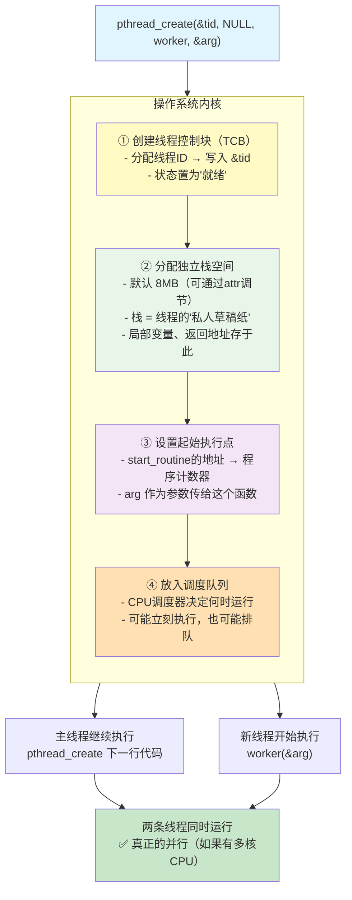

# pthread 从零讲解

> 和 Socket API 手册一样——每个函数：原型 → 参数 → 返回值 → 底层发生了什么 → 陷阱。

---

## 第一部分：概念基础

### 1.1 什么是线程

你写的程序启动时，操作系统给了你**一个"干活的单元"**——这就是主线程。它从 `main()` 开始，一句一句往下执行。

线程就是 CPU 执行代码的一条路径。一个进程可以有多个线程，每个线程互不干扰，同时执行：

```
单线程程序：                        多线程程序：
main() 开始                        main() 开始
  ↓                                  ↓
初始化                              创建线程1 ──→ worker1() 执行中...
  ↓                                  ↓
收消息                               创建线程2 ──→ worker2() 执行中...
  ↓                                  ↓
处理 ←── 所有事我一个人干              创建线程3 ──→ worker3() 执行中...
  ↓                                  ↓
广播                                 主线程继续等 epoll_wait
  ↓                                  ↓
回到开头                            线程1完成 → 线程2完成 → ...
```

**线程共享什么、不共享什么：**

| 共享（所有线程都能访问） | 不共享（每个线程私有的） |
|------------------------|------------------------|
| 全局变量 | **栈**（局部变量） |
| 堆内存（`new`/`malloc`） | 寄存器 |
| 文件描述符表 | 线程 ID |
| 信号处理函数 | errno |
| 当前工作目录 | 程序计数器（下一条指令地址） |

**关键结论：** 一个线程里的 `int client_fd = 4`，另一个线程拿不到这个 `client_fd`。但全局 `vector<int> clients` 所有线程都能看见——这就是后面要讲的数据竞争。

### 1.2 线程和进程的区别

| | 进程 | 线程 |
|------|------|------|
| 创建 | `fork()`（复制整个地址空间） | `pthread_create()`（共享地址空间） |
| 内存 | 独立，互不可见 | 共享，都能访问 |
| 开销 | 重（复制页表、文件描述符表） | 轻（只分配栈 + TCB） |
| 通信 | 需要 IPC（管道、共享内存等） | 直接读写共享变量 |
| 独立性 | 一个挂了另一个不受影响 | 一个挂了可能拖死全进程 |

服务器一般用线程而不是进程——因为线程间共享 fd 表和全局变量，交换数据几乎零成本。

### 1.3 线程库的选择

| | `<thread>`（C++11） | `pthread`（POSIX） |
|------|------|------|
| 头文件 | `#include <thread>` | `#include <pthread.h>` |
| 创建线程 | `std::thread t(func, arg)` | `pthread_create(&tid, NULL, func, &arg)` |
| 等待结束 | `t.join()` | `pthread_join(tid, NULL)` |
| 编译 | 不用额外链接 | 需要 `-lpthread` |
| 底层 | 包装 pthread | 直接对应内核 `clone()` 调用 |
| 暴露细节 | 少 | 多——你能看到每一步 |

**为什么网络编程用 pthread：** `recv`、`send`、`epoll_wait`、`errno`、`fcntl` 全是 C 接口。pthread 和它们风格统一，而且 `detach`、栈大小控制、信号屏蔽等细节在 `<thread>` 里被隐藏了——不利于理解服务器底层。

> 实际上 Linux 上 `std::thread` 底层就是 pthread。学了 pthread 再看 `<thread>` 会发现它只是套了一层 C++ 类的壳。

---

## 第二部分：核心函数（按日常使用频率排列）

### 2.1 `pthread_create()` —— 创建线程

```cpp
#include <pthread.h>

int pthread_create(pthread_t *thread,
                   const pthread_attr_t *attr,
                   void *(*start_routine)(void *),
                   void *arg);
```

**作用：** 告诉操作系统"给我复制一个干活的"。内核分配资源、创建新线程，新线程从 `start_routine` 开始执行，主线程继续往下走。

**参数详解：**

| 参数 | 类型 | 方向 | 含义 |
|------|------|------|------|
| `thread` | `pthread_t*` | **输出** | 内核把新线程的 ID 写到这里 |
| `attr` | `pthread_attr_t*` | 输入 | 线程属性，一般传 `NULL`（默认） |
| `start_routine` | `void* (*)(void*)` | 输入 | 函数指针—新线程从这个函数开始跑 |
| `arg` | `void*` | 输入 | 传给 `start_routine` 的参数 |

**返回值：**
- `0`：成功
- 非 0：错误码（和 socket 函数不同！pthread 不在 errno 里写，直接返回错误码）

**底层发生了什么：**

<details>
<summary>点击展开：pthread_create 内核四步创建流程</summary>



</details>
```

**线程函数签名：**

```cpp
void* worker(void* arg) {
    // 参数：void* 可以指向任何东西
    int client_fd = *(int*)arg;    // 强转回需要的类型

    // ... 干该干的活 ...

    return NULL;                   // 返回值可被 pthread_join 拿到
}
```

`void*` 的设计意图：C 语言没有泛型。`void*` 可以指向 int、fd、整个结构体——任意数据都能传。代价是要手动强转。

**⚠️ 陷阱 1：不能传局部变量的地址**

```cpp
// ❌ 错误
for (int i = 0; i < 10; i++) {
    pthread_create(&tid, NULL, worker, &i);  // &i 是一个会变化的地址！
}
// i 的值在 for 循环里不断变。线程可能还没开始跑，i 已经是 2 了。
// 三个线程都可能拿到同一个值。

// ✅ 正确
for (int i = 0; i < 10; i++) {
    int* p = new int(i);              // 每个线程分配独立的内存
    pthread_create(&tid, NULL, worker, p);
}
// 线程里用完记得 delete p;
```

**⚠️ 陷阱 2：不要忘记 join 或 detach**

```cpp
pthread_create(&tid, NULL, worker, &arg);
// 如果不调 join 也不调 detach：
//   → 线程结束后资源不回收
//   → "僵尸线程" → 内存泄漏
```

---

### 2.2 `pthread_join()` —— 等待线程结束

```cpp
int pthread_join(pthread_t thread, void **retval);
```

**作用：** 调用者停在这里，一直等到 `thread` 跑完。结束后内核回收该线程的资源。

| 参数 | 含义 |
|------|------|
| `thread` | 要等哪个线程 |
| `retval` | **输出**：取到线程函数的返回值。不需要可以传 `NULL` |

**类比：** 你等朋友一起吃完饭再去结账。join = 同步等待。

**底层发生了什么：**
1. 调用者线程进入睡眠状态
2. 内核一直等到目标线程结束
3. 目标线程的返回值写入 `*retval`
4. 回收目标线程的栈、TCB 等资源
5. 调用者被唤醒，继续执行

---

### 2.3 `pthread_detach()` —— 分离线程

```cpp
int pthread_detach(pthread_t thread);
```

**作用：** 告诉内核"这个线程结束的时候不用通知我，你自己回收就行"。调用后主线程立刻继续，不等待。

**类比：** 各吃各的，谁吃完谁走，不用互相等。

**和 join 的对比：**

| | `join` | `detach` |
|------|--------|---------|
| 调用后 | 阻塞等到线程结束 | 立即返回 |
| 资源回收 | join 返回时回收 | 线程结束时内核自动回收 |
| 获取返回值 | 可以 | 不能 |
| 适合场景 | 需要等结果 | 服务器——主线程要继续等 epoll |

**底层发生了什么：** 内核在线程的 TCB 里设了一个标志位 `detachstate = DETACHED`。线程结束时内核检查这个标志——如果是 DETACHED，回收资源时不通知任何人。

**必须二选一：** 每个线程要么 join、要么 detach。两个都不做 = 内存泄漏。

---

### 2.4 `pthread_self()` —— 获取自己的 ID

```cpp
pthread_t pthread_self(void);
```

返回当前线程的 ID。和 `getpid()` 获取进程 ID 类似。

---

### 2.5 `pthread_equal()` —— 判断两个线程 ID 是否相同

```cpp
int pthread_equal(pthread_t t1, pthread_t t2);
```

返回 0 = 不同，非 0 = 相同。**不能直接用 `==` 判断 `pthread_t` 是否相等**——`pthread_t` 在某些系统上是结构体，不是整数。

---

## 第三部分：互斥锁 —— 防止数据竞争

### 3.1 什么是数据竞争

两个线程同时操作一个共享变量：

```cpp
// clients 是全局 vector<int>
// 线程A 执行：clients.push_back(4);    // 向尾部加一个
// 线程B 执行：clients.erase(it);       // 删除中间一个

// 两个操作同时进行 → vector 内部数据损坏 → 程序崩溃
```

**互斥锁（Mutex）就是解决这个的：** 同一时刻只允许一个线程进入临界区。

### 3.2 `pthread_mutex_t` —— 互斥锁

```cpp
#include <pthread.h>

pthread_mutex_t lock = PTHREAD_MUTEX_INITIALIZER;

// 加锁
pthread_mutex_lock(&lock);
// ... 临界区：安全操作共享变量 ...
clients.push_back(fd);
pthread_mutex_unlock(&lock);
```

**四个核心函数：**

| 函数 | 作用 |
|------|------|
| `pthread_mutex_init` | 初始化互斥锁（等价于 `= PTHREAD_MUTEX_INITIALIZER`） |
| `pthread_mutex_lock` | 加锁。如果别人拿着锁，阻塞等到它释放 |
| `pthread_mutex_trylock` | 尝试加锁。拿不到立刻返回，不阻塞 |
| `pthread_mutex_unlock` | 释放锁 |

**底层发生了什么：**

`pthread_mutex_t` 内部有一个原子计数器。`lock` 时 CPU 执行一条原子指令（`cmpxchg`）：
- 如果计数器 = 0（没锁），设为 1，返回成功
- 如果计数器 = 1（有人持锁），调用者进入睡眠，等待持有者 unlock

**用 `{}` 包住临界区可以防止忘记 unlock：**

```cpp
{
    std::lock_guard<std::mutex> guard(mtx);   // C++11版，构造时lock，析构时unlock
    // ... 操作共享变量 ...
}  // guard 析构 → 自动 unlock
```

> C++ 的 `std::mutex` + `std::lock_guard` 底层就是 pthread_mutex_*。区别是 C++ 版不会忘记 unlock。

### 3.3 互斥锁使用规则

| 规则 | 原因 |
|------|------|
| 锁的粒度尽量小 | 锁住的时间越短，其他线程等的时间越短 |
| **绝不在持有锁时做 I/O** | `send`/`recv` 可能阻塞很久，所有线程都被卡住 |
| 避免嵌套加锁 | 线程A等B释放，B等A释放 → 死锁 |

---

## 第四部分：线程池

### 4.1 为什么需要线程池

每个请求来都 `pthread_create` 一次 → 用完 `pthread_detach`：

```
请求来 → pthread_create → 线程跑 → 干完活 → 线程销毁
请求来 → pthread_create → 线程跑 → 干完活 → 线程销毁
请求来 → pthread_create → 线程跑 → 干完活 → 线程销毁
                    ↑
          创建/销毁线程本身有开销
          频繁创建 → 内核分配栈(8MB) + TCB → 耗时
```

线程池：**提前开好几个线程，任务来了就从池子里拿一个空闲线程去干。干完不销毁，回到池子里等下个任务。**

```
启动时：一次性创建 4 个线程
        线程1[空闲] 线程2[空闲] 线程3[空闲] 线程4[空闲]

请求A来 → 分配给线程1 → 线程1[工作中]
请求B来 → 分配给线程2 → 线程2[工作中]
请求A完成 → 线程1[空闲] ← 回到池子

请求C来 → 分配给线程1 → 线程1[工作中]
...
```

### 4.2 最简单的线程池结构

```cpp
#include <pthread.h>
#include <queue>
#include <functional>

// 任务就是"一个要执行的函数"
using Task = std::function<void()>;
std::queue<Task> task_queue;           // 任务队列
pthread_mutex_t queue_lock = PTHREAD_MUTEX_INITIALIZER;
pthread_cond_t queue_cond = PTHREAD_COND_INITIALIZER;  // 条件变量

// 工作线程的主函数
void* worker_thread(void* arg) {
    while (true) {
        Task task;

        pthread_mutex_lock(&queue_lock);
        while (task_queue.empty()) {
            // 队列空了——睡觉，等主线程 wakeup
            pthread_cond_wait(&queue_cond, &queue_lock);
        }
        task = task_queue.front();     // 从队列取一个任务
        task_queue.pop();
        pthread_mutex_unlock(&queue_lock);

        task();  // 执行任务（不加锁！）
    }
    return NULL;
}

// 主线程提交任务
void submit_task(Task task) {
    pthread_mutex_lock(&queue_lock);
    task_queue.push(task);                     // 入队
    pthread_cond_signal(&queue_cond);          // 叫醒一个等待的工作线程
    pthread_mutex_unlock(&queue_lock);
}
```

### 4.3 条件变量 —— 线程池的核心机制

**问题：** 工作线程怎么知道"有任务了"？如果不断循环检查：

```cpp
// ❌ 忙等——浪费CPU
while (true) {
    if (!task_queue.empty()) {
        task = task_queue.front();
        // ...
    }
    // 没任务也在疯狂循环，CPU 100%
}
```

**解决——条件变量：**

```
工作线程：pthread_cond_wait(&cond, &lock)
         → 原子操作：释放锁 + 进入睡眠  (不会错过)
         → 被唤醒后：重新获取锁 + 返回

主线程：pthread_cond_signal(&cond)
       → 唤醒一个正在 wait 的线程
```

**`pthread_cond_wait` 为什么需要 mutex：**

```
如果条件变量不用锁：
  工作线程检查队列 → "空的" → 准备睡觉...
                                   ← 此时主线程 push 任务 + signal（没人醒！）
  工作线程睡觉...                   ← signal 已发出，被错过了！

用锁保证：
  工作线程：取锁 → 队列空 → wait（原子释放锁+睡觉）
  主线程：  取锁 → push任务 → signal → 释放锁
  工作线程：被唤醒 → wait(自动重新取锁) → 取出任务
```

| 函数 | 作用 |
|------|------|
| `pthread_cond_wait` | 原子操作：释放锁 → 睡眠 → 被唤醒后重新获取锁 |
| `pthread_cond_signal` | 唤醒**一个**在等待的线程 |
| `pthread_cond_broadcast` | 唤醒**所有**在等待的线程 |
| `pthread_cond_timedwait` | 带超时的 wait |

---

## 第五部分：常见错误排查

| 错误 | 原因 | 解决 |
|------|------|------|
| 创建线程但未 join/detach | 忘了 | 线程结束不回收 → 慢慢吃内存 |
| 线程拿到的参数值不对 | 传了局部变量地址 | 用 new 分配参数，线程里 delete |
| 程序随机崩溃 | 多线程同时操作 vector 等容器 | 加互斥锁保护 |
| `send` 卡死整个程序 | 持有锁时阻塞 I/O | **绝不在持有锁时 send/recv** |
| 线程从来不被唤醒 | signal 在 wait 之前发了 | 确保 lock 包裹 wait 前面的检查 |
| `pthread_create` 返回 -1 且内存不够 | 开了太多线程（每个默认 8MB 栈） | 用线程池限制线程数量 |

---

## 第六部分：函数速查总表

| 函数 | 头文件 | 作用 | 返回 |
|------|--------|------|------|
| `pthread_create` | `<pthread.h>` | 创建线程 | 0=成功 |
| `pthread_join` | `<pthread.h>` | 等线程结束+回收资源 | 0=成功 |
| `pthread_detach` | `<pthread.h>` | 分离线程，自动回收 | 0=成功 |
| `pthread_self` | `<pthread.h>` | 获取自己的线程 ID | pthread_t |
| `pthread_equal` | `<pthread.h>` | 比较两个线程 ID | 0=不同 |
| `pthread_mutex_init` | `<pthread.h>` | 初始化互斥锁 | 0=成功 |
| `pthread_mutex_lock` | `<pthread.h>` | 加锁（阻塞等待） | 0=成功 |
| `pthread_mutex_trylock` | `<pthread.h>` | 尝试加锁（不阻塞） | 0=成功 |
| `pthread_mutex_unlock` | `<pthread.h>` | 释放锁 | 0=成功 |
| `pthread_mutex_destroy` | `<pthread.h>` | 销毁互斥锁 | 0=成功 |
| `pthread_cond_init` | `<pthread.h>` | 初始化条件变量 | 0=成功 |
| `pthread_cond_wait` | `<pthread.h>` | 等待条件（释放锁+睡眠） | 0=成功 |
| `pthread_cond_signal` | `<pthread.h>` | 唤醒一个等待线程 | 0=成功 |
| `pthread_cond_broadcast` | `<pthread.h>` | 唤醒所有等待线程 | 0=成功 |
| `pthread_cond_destroy` | `<pthread.h>` | 销毁条件变量 | 0=成功 |

---

## 第七部分：编译方法

```bash
# 任何用到 pthread 的程序都要加 -lpthread
g++ -std=c++17 -o server server.cpp -lpthread

# CMakeLists.txt 里：
# find_package(Threads REQUIRED)
# target_link_libraries(myapp Threads::Threads)
```
