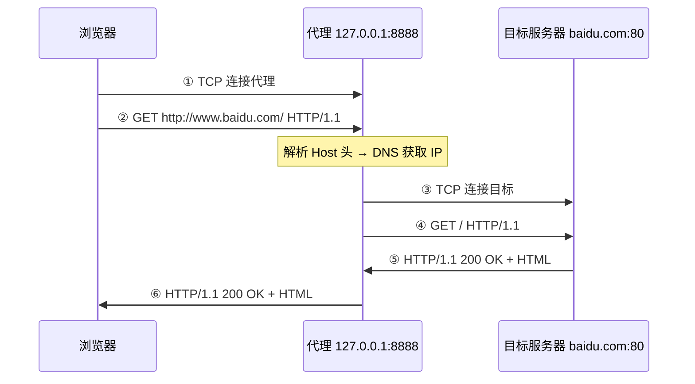
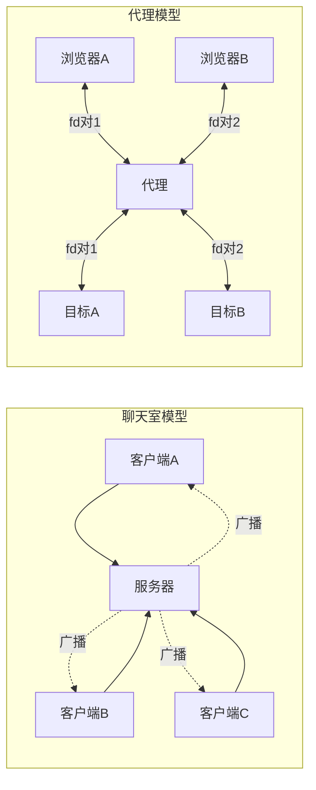

# 第十课：简易代理服务器 —— HTTP 正向代理

---

## 一、代理是什么

浏览器不直接连目标网站，而是先连代理。代理帮你连目标，拿到结果再转发回来：



**普通请求 vs 代理请求的区别：**

```
                                          ┌─ 关键区别在这里 ─┐
普通请求（浏览器直连百度）：                │                   │
  GET / HTTP/1.1              ← 相对路径  │                   │
  Host: www.baidu.com                     │                   │
                                           │                   │
代理请求（浏览器发给代理）：               │                   │
  GET http://www.baidu.com/ HTTP/1.1 ← 完整 URL              │
  Host: www.baidu.com                     │                   │
                                          └─ 代理需要从这里  ─┘
                                             解析出目标主机
```

---

## 二、架构对比：聊天室 vs 代理



| | 聊天室 | 代理 |
|------|--------|------|
| 数据流向 | 一对多广播 | 一对一双向转发 |
| 每个会话几个 fd | 1 个（客户端 fd） | **2 个**（browser_fd + target_fd） |
| 收到数据后 | 转发给所有其他人 | 转发给配对的另一个 fd |
| 数据结构 | `vector<int>` | `vector<ProxyPair>` |

**聊天室的数据流：**

```
客户端A说 "hello" → select 发现 A 的 fd 有动静
                 → recv 拿到 "hello"
                 → for 遍历所有客户端 fd：
                      send(客户端B fd, "hello")
                      send(客户端C fd, "hello")
```

**代理的数据流：**

```
浏览器 fd 有动静 → recv 拿到 HTTP 请求
                → 找到配对的 target_fd
                → send(配对的 target_fd, HTTP请求)
                
目标 fd 有动静   → recv 拿到 HTTP 响应
                → 找到配对的 browser_fd
                → send(配对的 browser_fd, HTTP响应)
```

---

## 三、数据结构 —— ProxyPair

```cpp
struct ProxyPair {
    int browser_fd;    // 浏览器这边的 fd
    int target_fd;     // 目标服务器那边的 fd（-1 = 尚未建立）
};
std::vector<ProxyPair> pairs;
```

**为什么两个 fd 必须绑一起？** select 返回后，你只知道"某个 fd 有数据了"——但不知道这个 fd 配对的另一个 fd 是什么。ProxyPair 解决的就是这个映射关系。

```
select 说：fd=5 有动静
  → 遍历 pairs 找到 browser_fd==5 或 target_fd==5 的那对
  → 找到后就知道"应该往另外那个 fd 转发数据"
```

**`target_fd` 初始为什么是 `-1`？** 浏览器刚连上来时，代理不知道它要访问什么网站。只有收到第一条 HTTP 请求、解析出 `Host` 头之后，才能 connect 目标服务器。connect 之前用 `-1` 占位。

---

## 四、完整代码（按模块拆分）

### 模块 1：初始化 — socket → bind → listen

```cpp
#include <iostream>     // std::cout, std::cerr
#include <cstring>      // strlen, strstr, memcpy
#include <string>       // std::string, std::stoi
#include <vector>       // std::vector
#include <sys/socket.h> // socket, bind, listen, accept, send, recv
#include <sys/select.h> // select, fd_set, FD_*
#include <netinet/in.h> // sockaddr_in, htons, INADDR_ANY
#include <arpa/inet.h>  // inet_pton（实际本代码未使用，可删）
#include <netdb.h>      // gethostbyname, struct hostent  ← 新课
#include <unistd.h>     // close
```

**新头文件 `<netdb.h>`：** 提供 `gethostbyname()` 函数和 `hostent` 结构体，用于 DNS 域名→IP 解析。之前你知道 DNS 是"查电话簿"，现在用代码亲手查。

```cpp
int server_fd = socket(AF_INET, SOCK_STREAM, 0);
int opt = 1;
setsockopt(server_fd, SOL_SOCKET, SO_REUSEADDR, &opt, sizeof(opt));

sockaddr_in addr{};
addr.sin_family = AF_INET;
addr.sin_addr.s_addr = INADDR_ANY;
addr.sin_port = htons(8888);     // 端口 8888，避让聊天室的 9999
bind(server_fd, (sockaddr*)&addr, sizeof(addr));
listen(server_fd, 10);
```

> 这一段和第一课完全一样，不再重复讲解。不记得的函数翻 [socket-api-reference](socket-api-reference.md)。

---

### 模块 2：select 循环骨架

```cpp
while (true) {
    fd_set read_fds;
    FD_ZERO(&read_fds);
    FD_SET(server_fd, &read_fds);
    int max_fd = server_fd;

    // 每对两个 fd 都要加入监控
    for (auto& p : pairs) {
        if (p.browser_fd > 0) {
            FD_SET(p.browser_fd, &read_fds);
            if (p.browser_fd > max_fd) max_fd = p.browser_fd;
        }
        if (p.target_fd > 0) {
            FD_SET(p.target_fd, &read_fds);
            if (p.target_fd > max_fd) max_fd = p.target_fd;
        }
    }

    select(max_fd + 1, &read_fds, nullptr, nullptr, nullptr);
```

```
          ┌─ fd_set 监控位图（本轮）─────────────┐
          │ fd=3      fd=4        fd=5        fd=6 │
          │ server_fd 浏览器A的fd  目标A的fd    浏览器B的fd │
          │   [1]       [1]         [1]          [1]   │
          └──────────────────────────────────────┘
          
select() 阻塞 → fd=5 有数据来了 →
          │ fd=3      fd=4        fd=5        fd=6 │
          │  [0]       [0]        [1]          [0]  │  ← 只剩 fd=5 亮着
          └──────────────────────────────────────┘
          
然后 FD_ISSET(5) 为真 → 在 pairs 里找到 target_fd=5 的那对
                      → 把数据 recv 出来 → send 给对应的 browser_fd
```

和聊天室一模一样的 select 模式。唯一区别：聊天室只盯客户端 fd，代理每对要盯两个 fd。`max_fd` 取全部监控 fd 中的最大值。

---

### 模块 3：accept 浏览器连接

```cpp
    if (FD_ISSET(server_fd, &read_fds)) {
        int browser_fd = accept(server_fd, nullptr, nullptr);
        if (browser_fd > 0) {
            pairs.push_back({browser_fd, -1});
            //                 ↑ 浏览器fd   ↑ 目标fd 先填 -1
            std::cout << "[代理] 浏览器连接, fd=" << browser_fd << "\n";
        }
    }
```

```
浏览器 connect → select 唤醒 → FD_ISSET(server_fd) 为真
                            → accept 拿到 browser_fd
                            → pairs 新增一对 {browser_fd, -1}
                            
新对：{ browser_fd=4, target_fd=-1 }
                           ↑
               "我还没连目标，等收到 HTTP 请求再说"
```

---

### 模块 4：双向转发 —— 情况A（浏览器 → 目标）

```cpp
    for (auto it = pairs.begin(); it != pairs.end(); ) {
        ProxyPair& p = *it;

        if (p.browser_fd > 0 && FD_ISSET(p.browser_fd, &read_fds)) {
            int n = recv(p.browser_fd, buf, sizeof(buf) - 1, 0);
            if (n <= 0) {                    // 浏览器断开
                close(p.browser_fd);
                if (p.target_fd > 0) close(p.target_fd);
                it = pairs.erase(it);
                continue;
            }
            buf[n] = '\0';

            if (p.target_fd < 0) {
                // ─── 第一次收到请求：解析 Host + DNS + connect ───
            } else {
                send(p.target_fd, buf, n, 0);   // 目标已建立，直接转发
            }
        }
```

```
情况A 流程图：

浏览器 recv 有数据
    │
    ├─ n ≤ 0 ─→ 浏览器断开 ─→ 关闭两端 fd ─→ 从 pairs 中删除
    │
    └─ n > 0
         │
         ├─ target_fd == -1 ─→ 首次请求 ─→ 模块5：解析Host+DNS+connect
         │
         └─ target_fd != -1 ─→ 直接 send(target_fd, data)
```

---

### 模块 5：解析 Host + DNS + connect（代理核心）

这是本课**最重要的新逻辑**。浏览器发来的请求是一坨文本：

```
GET http://www.baidu.com/ HTTP/1.1\r\n
Host: www.baidu.com\r\n
User-Agent: curl/8.5.0\r\n
Accept: */*\r\n
\r\n
```

代理需要从中提取 `www.baidu.com`，然后 DNS 解析 → connect → 转发请求。

#### 5.1 `strstr()` —— 在大文本里搜子串

```cpp
const char* host_start = strstr(buf, "Host: ");
```

```cpp
// 函数签名
const char* strstr(const char* haystack, const char* needle);
//                大草垛（被搜索的文本）    针（要搜的子串）
//
// 返回值：指向第一次匹配处；找不到返回 NULL
```

```
buf（浏览器发的 HTTP 请求片段）：
  "GET http://www.baidu.com/ HTTP/1.1\r\nHost: www.baidu.com\r\n..."
                                           ↑
                               strstr 返回这个位置
```

#### 5.2 跳过标签头 + 找到行尾

```cpp
host_start += 6;   // 跳过 "H-o-s-t-:-空格" 六个字节
//                 Host: www.baidu.com\r\n
//                   ↑ 跳前           ↑ 跳后

const char* host_end = strstr(host_start, "\r\n");
// HTTP 每行以 \r\n 结尾，host_end 指向域名末尾的 \r

std::string host(host_start, host_end - host_start);
//              起始指针     长度 = 结束-起始 = "www.baidu.com"
```

```
Host: www.baidu.com\r\n
      ├──────────┤
      host_start  host_end
      host_end - host_start = 13 字节 = "www.baidu.com"
```

#### 5.3 拆分端口号

```cpp
std::string target_host = host;   // "www.baidu.com" 或 "example.com:8080"
int target_port = 80;             // 默认 HTTP 端口

size_t colon = target_host.find(':');
if (colon != std::string::npos) {
    target_port = std::stoi(target_host.substr(colon + 1));
    //             std::stoi = 字符串 → 整数，"8080" → 8080
    target_host = target_host.substr(0, colon);
}
```

#### 5.4 `gethostbyname()` —— 代码里的 DNS 查询

```cpp
struct hostent* he = gethostbyname(target_host.c_str());
//              ↑ 域名 → 返回 hostent 结构体（含 IP 列表）
//                这是一个阻塞调用——DNS 不回，程序卡住
```

**`struct hostent` 详解：**

```cpp
struct hostent {
    char*   h_name;        // 官方域名，如 "www.baidu.com"
    char**  h_aliases;     // 别名列表（CDN 可能有多个别名）
    int     h_addrtype;    // 地址族：AF_INET = IPv4
    int     h_length;      // 一个 IP 的字节数：IPv4=4
    char**  h_addr_list;   // IP 地址数组（二进制，网络字节序，NULL 结尾）
};
```

```
gethostbyname("www.baidu.com") 返回：

  h_name ──→ "www.baidu.com"
  h_addr_list[0] ──→ [182, 61, 200, 6]   ← 第一个 IP（4字节二进制）
  h_addr_list[1] ──→ [182, 61, 200, 7]   ← 第二个 IP
  h_addr_list[2] ──→ NULL                 ← 数组结尾标记
```

**为什么返回多个 IP：** 百度在全国多机房部署，DNS 一次返回多个，让客户端选最快的。代理只取 `h_addr_list[0]`（第一个）。

#### 5.5 `memcpy` —— 直接拷贝 IP（避免二进制↔字符串冗余）

```cpp
int target_fd = socket(AF_INET, SOCK_STREAM, 0);
sockaddr_in taddr{};
taddr.sin_family = AF_INET;
taddr.sin_port = htons(target_port);
memcpy(&taddr.sin_addr, he->h_addr_list[0], he->h_length);
//     ↑ 目的地        ↑ 来源（4字节IP）  ↑ 拷贝4字节
```

```cpp
// memcpy 函数签名
void* memcpy(void* dest, const void* src, size_t n);
//           写到哪       从哪读        拷贝多少字节
```

**为什么用 `memcpy` 而不是 `inet_ntop` + `inet_pton`：**

```
错误做法（转两圈）：
  h_addr_list[0] → inet_ntop → "182.61.200.6" → inet_pton → 二进制
  二进制                                                       二进制
  转一：二进制→字符串    转二：字符串→二进制
  无意义！IP 本身就是二进制，DNS 返回的也是二进制

正确做法（直接拷贝）：
  h_addr_list[0] → memcpy(4字节) → 二进制
  一步到位
```

#### 5.6 connect + 错误检查

```cpp
if (connect(target_fd, (sockaddr*)&taddr, sizeof(taddr)) < 0) {
    std::cerr << "[代理] 连接目标失败: " << target_host << "\n";
    close(target_fd);
    close(p.browser_fd);
    it = pairs.erase(it);
    continue;
}
p.target_fd = target_fd;  // connect 成功，记录目标 fd
send(target_fd, buf, n, 0);  // 把缓存的 HTTP 请求转发给目标
```

**注意这里的 `taddr` 不是 `addr`：**

```
addr = bind 用的 0.0.0.0:8888  ← 代理自己
taddr = 目标服务器的地址        ← DNS 解析出来的

connect 必须用 taddr，用 addr 等于自己连自己
```

---

### 模块 6：双向转发 —— 情况B（目标 → 浏览器）

```cpp
        if (p.target_fd > 0 && FD_ISSET(p.target_fd, &read_fds)) {
            int n = recv(p.target_fd, buf, sizeof(buf) - 1, 0);
            if (n <= 0) {
                close(p.target_fd);
                close(p.browser_fd);
                it = pairs.erase(it);
                continue;
            }
            send(p.browser_fd, buf, n, 0);
        }  // 情况B与情况A完全对称
```

```
        情况A                       情况B
   浏览器 → 代理 → 目标         目标 → 代理 → 浏览器
      ↓          ↓                 ↓          ↓
   recv       send             recv       send
 (browser)  (target)         (target)  (browser)
```

---

## 五、完整代码（合并版）

> 前面已经按模块拆分讲过，此处放完整代码供编译运行。

```cpp
#include <iostream>
#include <cstring>
#include <string>
#include <vector>
#include <sys/socket.h>
#include <sys/select.h>
#include <netinet/in.h>
#include <arpa/inet.h>
#include <netdb.h>
#include <unistd.h>

int main() {
    int server_fd = socket(AF_INET, SOCK_STREAM, 0);

    int opt = 1;
    setsockopt(server_fd, SOL_SOCKET, SO_REUSEADDR, &opt, sizeof(opt));

    sockaddr_in addr{};
    addr.sin_family = AF_INET;
    addr.sin_addr.s_addr = INADDR_ANY;
    addr.sin_port = htons(8888);
    bind(server_fd, (sockaddr*)&addr, sizeof(addr));
    listen(server_fd, 10);

    std::cout << "[代理] 监听 0.0.0.0:8888\n";

    struct ProxyPair {
        int browser_fd;
        int target_fd;
    };
    std::vector<ProxyPair> pairs;

    while (true) {
        fd_set read_fds;
        FD_ZERO(&read_fds);
        FD_SET(server_fd, &read_fds);
        int max_fd = server_fd;

        for (auto& p : pairs) {
            if (p.browser_fd > 0) {
                FD_SET(p.browser_fd, &read_fds);
                if (p.browser_fd > max_fd) max_fd = p.browser_fd;
            }
            if (p.target_fd > 0) {
                FD_SET(p.target_fd, &read_fds);
                if (p.target_fd > max_fd) max_fd = p.target_fd;
            }
        }

        select(max_fd + 1, &read_fds, nullptr, nullptr, nullptr);

        // ① 浏览器连接
        if (FD_ISSET(server_fd, &read_fds)) {
            int browser_fd = accept(server_fd, nullptr, nullptr);
            if (browser_fd > 0) {
                pairs.push_back({browser_fd, -1});
                std::cout << "[代理] 浏览器连接, fd=" << browser_fd << "\n";
            }
        }

        // ② 双向转发
        char buf[8192];
        for (auto it = pairs.begin(); it != pairs.end(); ) {
            ProxyPair& p = *it;

            // 情况A：浏览器 → 目标
            if (p.browser_fd > 0 && FD_ISSET(p.browser_fd, &read_fds)) {
                int n = recv(p.browser_fd, buf, sizeof(buf) - 1, 0);
                if (n <= 0) {
                    std::cout << "[代理] 浏览器断开, fd=" << p.browser_fd << "\n";
                    close(p.browser_fd);
                    if (p.target_fd > 0) close(p.target_fd);
                    it = pairs.erase(it);
                    continue;
                }
                buf[n] = '\0';

                if (p.target_fd < 0) {
                    // 首次请求：解析 Host → DNS → connect
                    const char* host_start = strstr(buf, "Host: ");
                    if (!host_start) {
                        std::cerr << "[代理] 请求中没有 Host 头\n";
                        close(p.browser_fd);
                        it = pairs.erase(it);
                        continue;
                    }
                    host_start += 6;
                    const char* host_end = strstr(host_start, "\r\n");
                    if (!host_end) {
                        std::cerr << "[代理] Host 头格式异常\n";
                        close(p.browser_fd);
                        it = pairs.erase(it);
                        continue;
                    }
                    std::string host(host_start, host_end - host_start);

                    std::string target_host = host;
                    int target_port = 80;
                    size_t colon = target_host.find(':');
                    if (colon != std::string::npos) {
                        target_port = std::stoi(target_host.substr(colon + 1));
                        target_host = target_host.substr(0, colon);
                    }

                    struct hostent* he = gethostbyname(target_host.c_str());
                    if (!he) {
                        std::cerr << "[代理] DNS 失败: " << target_host << "\n";
                        close(p.browser_fd);
                        it = pairs.erase(it);
                        continue;
                    }

                    int target_fd = socket(AF_INET, SOCK_STREAM, 0);
                    sockaddr_in taddr{};
                    taddr.sin_family = AF_INET;
                    taddr.sin_port = htons(target_port);
                    memcpy(&taddr.sin_addr, he->h_addr_list[0], he->h_length);

                    if (connect(target_fd, (sockaddr*)&taddr, sizeof(taddr)) < 0) {
                        std::cerr << "[代理] 连接目标失败: " << target_host << "\n";
                        close(target_fd);
                        close(p.browser_fd);
                        it = pairs.erase(it);
                        continue;
                    }
                    p.target_fd = target_fd;

                    send(target_fd, buf, n, 0);
                    std::cout << "[代理] 连接目标 " << target_host << ":"
                              << target_port << ", fd=" << target_fd << "\n";
                } else {
                    send(p.target_fd, buf, n, 0);
                }
            }

            // 情况B：目标 → 浏览器
            if (p.target_fd > 0 && FD_ISSET(p.target_fd, &read_fds)) {
                int n = recv(p.target_fd, buf, sizeof(buf) - 1, 0);
                if (n <= 0) {
                    std::cout << "[代理] 目标断开, fd=" << p.target_fd << "\n";
                    close(p.target_fd);
                    close(p.browser_fd);
                    it = pairs.erase(it);
                    continue;
                }
                send(p.browser_fd, buf, n, 0);
            }

            ++it;
        }
    }
}
```

编译：`g++ -std=c++17 -o proxy proxy.cpp`

---

## 六、新函数速查

| 函数 | 头文件 | 作用 | 关键点 |
|------|--------|------|--------|
| `strstr(str, sub)` | `<cstring>` | 在大文本中搜子串，返回指针 | 找不到返回 `NULL`，必须判空 |
| `gethostbyname(domain)` | `<netdb.h>` | DNS 域名→`hostent`（含 IP 列表） | 阻塞调用；已过时，但入门最简单 |
| `hostent.h_addr_list[0]` | — | DNS 返回的第一个 IP（4字节二进制） | 直接可 `memcpy` 进 `sockaddr_in` |
| `hostent.h_length` | — | IP 地址字节数（IPv4=4，IPv6=16） | `memcpy` 的第三个参数 |
| `memcpy(dst, src, n)` | `<cstring>` | 拷贝 n 字节原始内存 | 比 `inet_ntop`+`inet_pton` 省一步转换 |
| `std::stoi(str)` | `<string>` | 字符串→int | 用于 "8080" → 8080 |
| `std::string::find(ch)` | `<string>` | 找字符位置 | 检测 "host:port" 中的 `:` |

---

## 七、测试

```bash
# 终端1
g++ -std=c++17 -o proxy proxy.cpp
./proxy

# 终端2
curl -v -x http://127.0.0.1:8888 http://www.baidu.com
#          ↑ --proxy 简写：通过代理发送请求
```

终端1 预期输出：

```
[代理] 监听 0.0.0.0:8888
[代理] 浏览器连接, fd=4
[代理] 连接目标 www.baidu.com:80, fd=5
```

终端2 预期输出：`HTTP/1.1 200 OK` + 百度首页 HTML。

---

## 八、开发中踩到的坑

| 问题 | 现象 | 根因 | 修复 |
|------|------|------|------|
| connect 用了 `addr` 而非 `taddr` | curl 超时无响应 | 连了自己 `0.0.0.0:8888` | `&addr` → `&taddr` |
| `'/quit'` vs `"/quit"`（本课无关，聊天室继承） | 编译通过但不生效 | 单引号 = `int`，非字符串 | 双引号 |
| connect 调了两次 | 结果被覆盖，无实际影响 | 调试残留 | 删除冗余调用 |
| `inet_ntop`→`inet_pton` 冗余转换 | 代码可运行但绕路 | DNS 返回的就是二进制 | 改用 `memcpy` |
| `strstr` 返回 NULL 未判空 | 特定请求格式会崩溃 | Host 头缺失 | 加上 `if (!host_end)` 分支 |

---

## 九、缺陷与改进方向

| 缺陷 | 影响 | 改进方案 |
|------|------|---------|
| `gethostbyname` 阻塞 | 一个慢 DNS 查询卡住所有会话 | `getaddrinfo` + 异步 DNS（c-ares） |
| 不支持 IPv6 | 纯 IPv6 网站无法访问 | `getaddrinfo` 替代 `gethostbyname` |
| 未修改请求行 | 代理发了完整 URL 给目标，严格服务器可能拒绝 | 把 `GET http://host/` 改回 `GET /` |
| 不支持 HTTPS | `curl -x https://...` 会失败 | 实现 CONNECT 隧道方法 |
| send 未处理部分发送 | 大数据可能一次 send 不完 | 循环调用直到发完 |
| 单线程 | 上百会话时 select 遍历成为瓶颈 | 升级 epoll / 线程池 |

---

## 十、关联回顾

| 本课用到的知识 | 来源 |
|---------------|------|
| socket/bind/listen/accept/connect/send/recv | 实1 TCP |
| select + fd_set + FD_ZERO/SET/ISSET | 实5 聊天室 |
| DNS 域名→IP 概念 | 基础笔记 第6课 |
| HTTP 请求/响应格式 | 基础笔记 第5课 |
| curl -x 代理测试 | 实2 诊断命令 |
| erase(it) + continue 迭代器模式 | 实5 聊天室 |

---

## 十一、自测题

1. 代理为什么需要 `ProxyPair` 存两个 fd？和聊天室 `vector<int>` 有什么本质区别？
2. `strstr(buf, "Host: ")` 和 `strstr(host_start, "\r\n")` 各起了什么作用？
3. `hostent` 结构体里 `h_addr_list` 和 `h_length` 分别是什么？
4. `memcpy(&taddr.sin_addr, he->h_addr_list[0], 4)` 比 `inet_ntop` + `inet_pton` 好在哪？
5. `connect(target_fd, &taddr, ...)` 如果写成 `&addr` 会怎样？

<details>
<summary>点击查看答案</summary>

1. 聊天室是广播——一个 fd 收，发给所有其他 fd，不需要配对。代理是双向转发——浏览器 fd 和 目标 fd 必须一一对应。FD_ISSET 告诉你"fd=X 有数据"，你得知道 X 配对的是哪个 fd 才能转发，所以用 ProxyPair 绑在一起。
2. `strstr(buf, "Host: ")` = 在 HTTP 请求全文里定位 `Host` 头的起始位置。`strstr(host_start, "\r\n")` = 定位 `Host` 头行的结束位置（HTTP 每行以 `\r\n` 结尾）。两个指针相减 = 域名长度。
3. `h_addr_list` 是 DNS 返回的 IP 地址数组，`[0]` 是第一个 IP，二进制格式。`h_length` 是每个 IP 的字节数（IPv4=4，IPv6=16），用作 `memcpy` 拷贝长度。
4. DNS 返回的 IP 已经是二进制了。`inet_ntop` 转成字符串再 `inet_pton` 转回去是无意义的往返。`memcpy` 直接从 `h_addr_list[0]` 拷 4 字节到 `sin_addr`，一步到位。
5. `addr` 是代理 `bind` 用的 `INADDR_ANY:8888`，是代理自己的地址。`connect(target_fd, &addr, ...)` = 连自己，curl 会超时或被拒绝。必须用 DNS 解析出来的 `taddr`。

</details>
