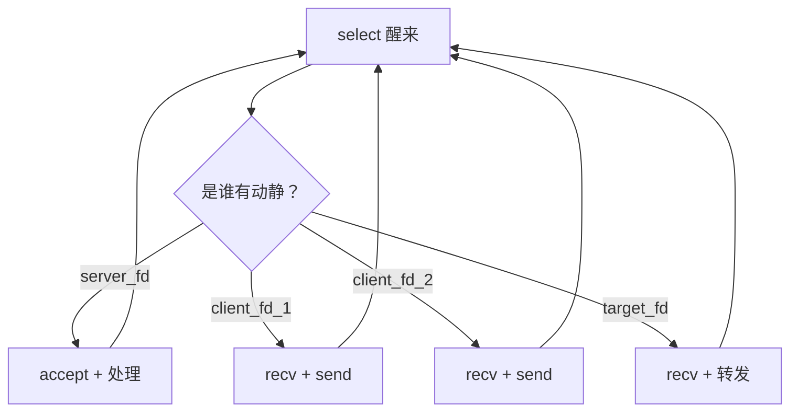

# 第十一课：事件驱动与 Reactor 模式

> 这一课不是学新的系统调用，是学**怎样组织代码**——从面向过程到事件驱动。

---

## 一、问题的根源

前 10 课所有程序的 `while(true)` 都长这样：

```cpp
while (true) {
    select();                         // 等事件
    if (FD_ISSET(server_fd, ...)) {   // 判断谁有动静
        accept();                     // 处理逻辑
    }
    for (...) {
        if (FD_ISSET(client_fd, ...)) {
            recv(); send();
        }
    }
}
```



**问题：事件检测和业务处理混在一个大循环里。** 每加一个新功能（如代理 支持 CONNECT 隧道、聊天室支持群发图片），就得在主循环里加更多 if/else，代码越来越难读。

---

## 二、Reactor 的核心思想

**把"谁有动静"和"怎么办"分开：**

```mermaid
flowchart LR
    subgraph Reactor框架
        A[事件循环] --> B[select/epoll]
        B --> C[查注册表]
        C --> D[调对应的回调函数]
    end
    
    subgraph 用户代码（回调函数）
        E[handle_accept]
        F[handle_read]
        G[handle_write]
    end
    
    D --> E
    D --> F
    D --> G
```

Reactor 框架只负责一件事："fd 有动静 → 找到注册的回调 → 调用它"。**业务逻辑完全写在回调里。** 事件循环永不变，想加功能只加回调。

**类比：公司前台**

| 现实 | Reactor |
|------|---------|
| 前台接电话 | select/epoll |
| 电话响了查"来电转接表" | 查 `handlers_` 注册表 |
| 转给对应部门 | 调对应的回调函数 |

前台从不问"电话内容是什么"，只负责转接。业务由每个部门自己处理。

---

## 三、核心类 —— Reactor

```cpp
#include <functional>   // std::function

// 事件处理器：fd 上有可读事件时调用的函数
using EventHandler = std::function<void(int fd)>;

class Reactor {
public:
    // 注册 fd  →  回调函数
    void add_handler(int fd, EventHandler handler) {
        handlers_.push_back({fd, handler});
    }

    void remove_handler(int fd) {
        // 从 handlers_ 中移除对应 fd
        auto it = std::remove_if(handlers_.begin(), handlers_.end(),
            [fd](const HandlerEntry& e) { return e.fd == fd; });
        handlers_.erase(it, handlers_.end());
    }

    // 启动事件循环
    void run() {
        while (running_) {
            fd_set read_fds;
            FD_ZERO(&read_fds);
            int max_fd = -1;

            // ① 把注册表里所有 fd 加入 select 监控
            for (auto& entry : handlers_) {
                FD_SET(entry.fd, &read_fds);
                if (entry.fd > max_fd) max_fd = entry.fd;
            }

            if (max_fd < 0) break;

            // ② 阻塞等事件
            select(max_fd + 1, &read_fds, nullptr, nullptr, nullptr);

            // ③ 分发事件：谁的 bit 亮了，调谁的回调
            for (auto& entry : handlers_) {
                if (FD_ISSET(entry.fd, &read_fds)) {
                    entry.handler(entry.fd);
                }
            }
        }
    }

    void stop() { running_ = false; }

private:
    struct HandlerEntry {
        int fd;
        EventHandler handler;
    };
    std::vector<HandlerEntry> handlers_;
    bool running_ = true;
};
```

### 参数逐个讲解

**`EventHandler = std::function<void(int fd)>`**

`std::function` 是 C++ 标准库的类型擦除容器——能存储函数指针、lambda、成员函数包装后的结果。`<void(int fd)>` 表示"接收一个 int 参数，不返回值"。

为什么用 `std::function` 而不用裸函数指针——因为回调通常要访问外部变量（如 `clients`、`pairs`、`reactor` 自身），用函数指针做不到，lambda 配合 `std::function` 可以。

**`add_handler(fd, handler)`**

向 Reactor 注册："帮我看住 fd，有数据可读时调用 handler"。内部把 `{fd, handler}` 存进 `handlers_` 容器。

**`run()` 三步骤：**

```
① FD_ZERO + 遍历 handlers_ → FD_SET 每个 fd → 确定 max_fd
      ↓
② select(max_fd+1, ...) — 阻塞等事件
      ↓
③ 遍历 handlers_ → 对每个 entry，FD_ISSET 为真则 entry.handler(fd)
```

和之前手写的 select 循环完全相同的逻辑。区别：fd 和回调来自 `handlers_` 注册表，不是硬编码死在循环里。

---

## 四、用 Reactor 重写 TCP Echo 服务器

### 完整代码

```cpp
#include <iostream>
#include <vector>
#include <functional>
#include <sys/socket.h>
#include <sys/select.h>
#include <netinet/in.h>
#include <unistd.h>

using EventHandler = std::function<void(int fd)>;

class Reactor { /* 同上，含 add_handler / remove_handler / run / stop */ };

int main() {
    int server_fd = socket(AF_INET, SOCK_STREAM, 0);

    int opt = 1;
    setsockopt(server_fd, SOL_SOCKET, SO_REUSEADDR, &opt, sizeof(opt));

    sockaddr_in addr{};
    addr.sin_family = AF_INET;
    addr.sin_addr.s_addr = INADDR_ANY;
    addr.sin_port = htons(9999);
    bind(server_fd, (sockaddr*)&addr, sizeof(addr));
    listen(server_fd, 10);

    Reactor reactor;
    std::vector<int> clients;

    // 回调①：新客户端连接 → accept + 注册新回调
    reactor.add_handler(server_fd, [&](int fd) {
        int client_fd = accept(fd, nullptr, nullptr);
        if (client_fd < 0) return;
        clients.push_back(client_fd);
        std::cout << "[Reactor] 新客户端, fd=" << client_fd << "\n";

        // 回调②：客户端发来消息 → recv → echo 回送
        reactor.add_handler(client_fd, [&](int cfd) {
            char buf[1024];
            int n = recv(cfd, buf, sizeof(buf) - 1, 0);
            if (n <= 0) {
                std::cout << "[Reactor] 客户端断开, fd=" << cfd << "\n";
                close(cfd);
                reactor.remove_handler(cfd);
                return;
            }
            buf[n] = '\0';
            send(cfd, buf, n, 0);   // echo
        });
    });

    std::cout << "[Reactor] 监听 0.0.0.0:9999\n";
    reactor.run();
}
```

编译：`g++ -std=c++17 -o reactor_demo reactor_demo.cpp`

---

### `[&]` lambda 捕获详解

```cpp
reactor.add_handler(server_fd, [&](int fd) {
    //    ↑                    ↑      ↑
    //   以引用方式捕获         参数   fd 是 Reactor 调用回调时传进来的
    //   外部所有变量            列表
});
```

`[&]` 表示"以引用方式捕获**所有**外部可见变量"。这个回调函数里用到的 `reactor`、`clients`、`std::cout` 全是外部的——不加 `[&]` 编译直接报错"变量未声明"。

**捕获列表选项：**

| 写法 | 含义 | 使用场景 |
|------|------|---------|
| `[&]` | 引用捕获所有 | 简单场景，回调需要读写外部变量 |
| `[=]` | 值捕获所有（拷贝） | 只需读外部变量，不做修改 |
| `[&reactor, &clients]` | 只引用捕获指定的 | 精确控制，避免误捕获 |
| `[this]` | 捕获 `this` 指针 | 在类的方法内定义 lambda |

---

### 对比表：面向过程 vs Reactor

| | 第一课（面向过程） | 本课（Reactor） |
|------|-----------------|----------------|
| 主循环 | 每次手写 while/select/FD_ZERO | `reactor.run()` 一行 |
| 添加新 fd | 在循环里加 if/else | `add_handler(fd, callback)` |
| 业务逻辑 | 混在 select 循环里 | 独立回调函数 |
| 可复用性 | 每次从头写 | 一个 Reactor 类到处用 |
| 回调里再加回调 | 代码越来越乱 | 天然支持——`add_handler` 哪儿都能调 |
| 代码行数（echo） | ~50 行 main | ~20 行 main + 通用 Reactor 类 |

---

## 五、新东西总结

### `std::function` —— 通用函数包装器

```cpp
#include <functional>

std::function<void(int)> handler;     // 能存储"接收 int，不返回"的任何可调用对象
handler = my_function;                // 存普通函数
handler = [](int x) { cout << x; };   // 存 lambda
```

不需要关心底层是什么——函数指针、lambda、仿函数，`std::function` 都能装。

### C++ Lambda 表达式

```cpp
[capture](params) { body }

// 例
[&](int fd) {
    std::cout << "fd=" << fd << " 有数据\n";
    char buf[1024];
    recv(fd, buf, sizeof(buf) - 1, 0);
}
```

`[&]` = 引用捕获外部变量；`(int fd)` = 参数列表，由 Reactor 调用时传入；`{ }` = 函数体。

### `std::remove_if` + `erase` —— 删除容器中满足条件的元素

```cpp
// 从 handlers_ 中删除 fd == cfd 的那条记录
auto it = std::remove_if(handlers_.begin(), handlers_.end(),
    [fd](const HandlerEntry& e) { return e.fd == fd; });
handlers_.erase(it, handlers_.end());
```

---

## 六、与前面所有课的关系

| 之前的代码复用 | Reactor 中的复用 |
|-------------|----------------|
| socket/bind/listen/accept/recv/send | 在回调里原样使用 |
| select + FD_ZERO/SET/ISSET | 封装在 `run()` 里，不再手写 |
| 聊天室广播、代理转发 | 各自写成独立回调，互不干扰 |

**Reactor 不替代任何网络 API，它只是改变了它们被调用的方式。**

---

## 七、缺陷与改进方向

1. **select 上限仍是 1024**：底层仍用 select，fd 不能超 1023。Reactor 的 `run()` 改成 `epoll_wait` 即可突破。
2. **FD_ISSET 的回调内不能修改 `handlers_`**：回调里 `add_handler` 可能导致 `handlers_` 扩容，正在遍历的迭代器失效。当前代码在 `handlers_` 遍历期间 call 回调，有潜在风险。生产代码应延迟执行——回调只是**标记**，循环结束后再统一增删。
3. **不支持写事件**：当前只监控可读事件。代理的双向转发场景需要同时监控可读+可写，`add_handler` 应加第二个参数指定事件类型。
4. **单线程**：Reactor 的 `run()` 在主线程跑。CPU 密集型回调会卡住全部事件。实际框架（libevent、libuv）支持多线程 Reactor。

---

## 八、自测题

1. Reactor 模式的核心思想是什么？和面向过程写法有什么区别？
2. `add_handler` 的回调参数 `(int fd)` 是谁传进来的？和 lambda 捕获的 `[&]` 有什么区别？
3. 为什么 accept 回调**里面**又调了 `add_handler`？这在面向过程写法里怎么做？
4. Reactor 的 `run()` 和你之前手写的 select 循环，三步逻辑（ZERO/SET → select → ISSST/分发）有什么不同？

<details>
<summary>点击查看答案</summary>

1. 核心思想是**事件检测和事件处理分离**。面向过程写法把"谁有动静"和"怎么办"全塞在一个 while 循环里，加功能要改主循环。Reactor 把"谁有动静"封装在框架里，"怎么办"由注册的回调各自负责——加功能只加回调不碰循环。
2. `(int fd)` 是 Reactor 调用回调时传进来的——就是 `FD_ISSET` 为真的那个 fd。`[&]` 是 lambda 定义时捕获的外部变量（reactor、clients 等），在回调体内直接使用。两者来源不同：参数来自 Reactor，捕获来自外部作用域。
3. 因为新客户端连上来后会持续发消息，你得立刻"盯住"它的 fd。accept 回调里调 `add_handler(client_fd, 读消息回调)` 就是注册对这个客户端的长期监控。面向过程写法中，这个逻辑是在 while 循环里用 `clients` 列表管理——每次 select 醒来后遍历 `clients`，对每个 fd 逐一 FD_ISSET。
4. 三步逻辑完全相同。区别只在于 fd 和回调的来源：手写版 fd 和业务逻辑硬编码在循环体里；Reactor 版 fd 来自 `handlers_` 注册表，业务逻辑来自注册的回调。循环本身不变，变的是数据来源。

</details>
