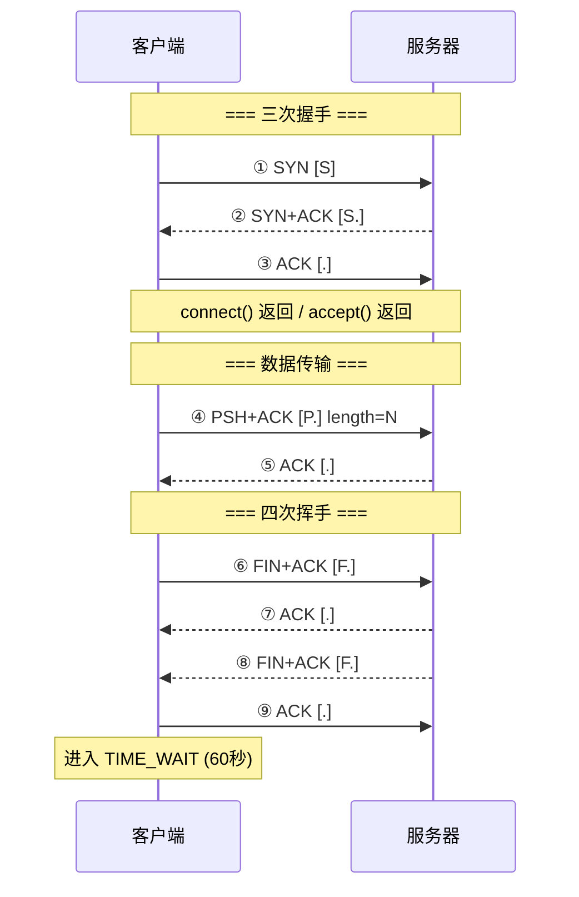
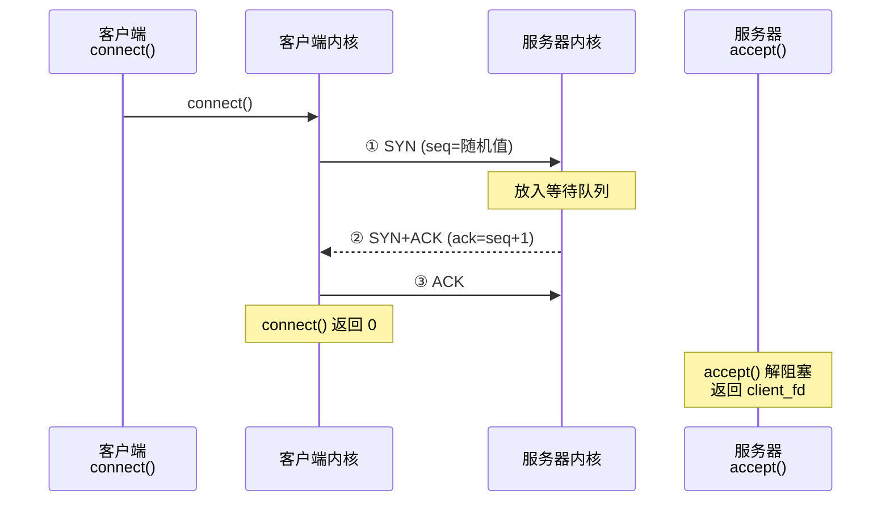
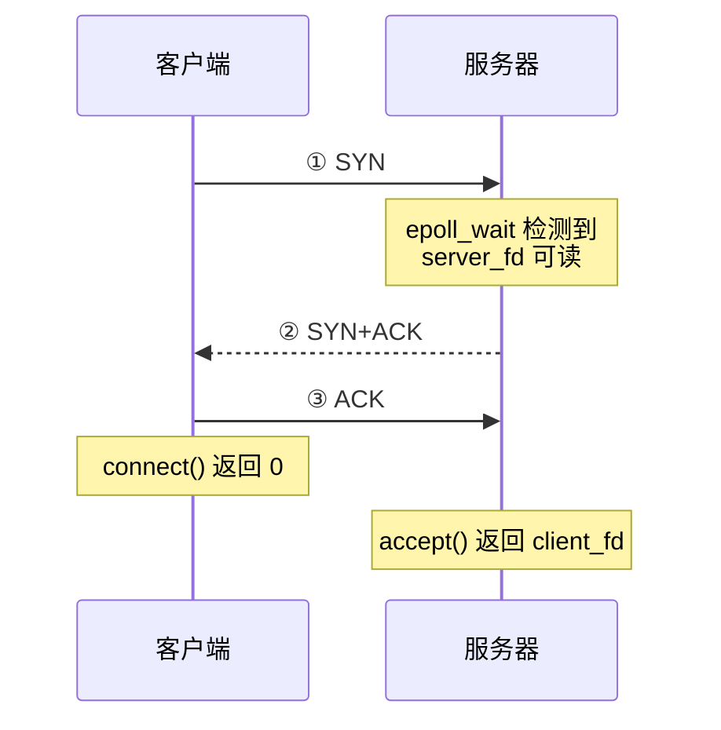
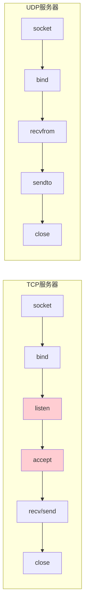

# Socket API 从零讲解

> 不是速查，是从零开始理解每个 socket 函数的参数、返回值和底层逻辑。

---

## 第一部分：概念基础

### 1.1 什么是 socket

**socket 就是内核提供给你操作网络的"把手"。** 你想通过网络发数据、收数据，不能直接操作网卡硬件——只能通过内核提供的 socket 接口间接操作。

<details>
<summary>点击展开：程序 ↔ 内核 ↔ 网络 数据流</summary>

```mermaid
flowchart LR
    subgraph 你的程序
        A1[socket()]
        A2[send()]
        A3[recv()]
        A4[close()]
    end
    subgraph 内核
        B1[分配socket资源]
        B2[TCP分包/IP路由/封装]
        B3[解封装/重组/校验]
        B4[发FIN/释放资源]
    end
    subgraph 网络
        C1[网卡发出]
        C2[网卡收到]
    end
    A1 -->|""申请socket""| B1
    A2 -->|""数据交给内核""| B2 -->|""发出""| C1
    C2 -->|""收到""| B3 -->|""数据上交""| A3
    A4 -->|""通知关闭""| B4
```
</details>

**类比：socket 就是你申请的电话机。** `socket()` 是买电话，`bind()` 是把电话线插墙上，`listen()` 是话务员就位，`accept()` 是接起电话，`send()/recv()` 是通话，`close()` 是挂断。

### 1.2 文件描述符（File Descriptor，fd）

**这是 Linux 系统编程最重要的概念。**

在 Linux 上，一切 I/O 都抽象为**文件描述符**——一个非负整数：

| fd | 默认指向 | 
|----|---------|
| 0 | 标准输入（键盘） |
| 1 | 标准输出（屏幕） |
| 2 | 标准错误（屏幕） |

```cpp
int fd = open("file.txt", O_RDONLY);  // fd = 3（最小的未使用编号）
int sock = socket(AF_INET, SOCK_STREAM, 0);  // sock = 4

// 对内核来说，fd 就是数组下标。内核维护一张表：
// fd_table[3] → file.txt 的 inode
// fd_table[4] → TCP socket 的内核数据结构
```

**socket() 返回的 fd 和 open() 返回的 fd 是同一种东西**——都是整数，都可以传给 `read()`/`write()`/`close()`，内核一视同仁。这就是"一切皆文件"。

**fd 编号规则：** 内核总是分配**最小的未使用编号**。关掉 fd=3，下次 `socket()` 就拿到 3。这就是为什么聊天室里客户端 fd 从 4 开始——0/1/2 被标准输入输出占用，3 是 server_fd。

---

## 第二部分：TCP 服务器端函数（按调用顺序）

一个 TCP 服务器的标准流程：

```mermaid
flowchart TD
    S[socket<span style="opacity:0.5">&#40;&#41;</span>] --> O[setsockopt<span style="opacity:0.5">&#40;&#41;</span>]
    O --> B[bind<span style="opacity:0.5">&#40;&#41;</span>]
    B --> L[listen<span style="opacity:0.5">&#40;&#41;</span>]
    L --> LOOP{select/epoll_wait}
    LOOP -->|""新连接""| A[accept<span style="opacity:0.5">&#40;&#41;</span>]
    A --> LOOP
    LOOP -->|""有数据""| R[recv<span style="opacity:0.5">&#40;&#41;</span>]
    R -->|""回复""| W[send<span style="opacity:0.5">&#40;&#41;</span>]
    W --> LOOP
    R -->|""断连""| C[close<span style="opacity:0.5">&#40;&#41;</span>]
    C --> LOOP

    style S fill:#e1f5fe
    style O fill:#fff9c4
    style B fill:#e1f5fe
    style L fill:#fff9c4
    style LOOP fill:#f3e5f5
    style A fill:#e8f5e9
    style R fill:#e8f5e9
    style W fill:#e8f5e9
    style C fill:#ffebee
```

<details>
<summary>点击展开：TCP 服务器 7 步调用流程</summary>


</details>

### 2.1 `socket()` — 创建 socket

```cpp
#include <sys/socket.h>

int socket(int domain, int type, int protocol);
```

**作用：** 向内核申请创建一个 socket，内核分配资源后返回一个 fd。这是所有网络编程的第一步。

**参数详解：**

| 参数 | 类型 | 常用值 | 含义 |
|------|------|--------|------|
| `domain` | `int` | `AF_INET` | 地址族 = 用什么版本的 IP。`AF_INET` 是 IPv4，`AF_INET6` 是 IPv6 |
| `type` | `int` | `SOCK_STREAM` | 传输层用什么协议。`SOCK_STREAM` = TCP（面向连接、可靠、流式） |
| `protocol` | `int` | `0` | 前两个参数已经确定了协议，填 0 让内核自动选择 |

**返回值：**
- 成功：非负整数 fd（例如 3）
- 失败：-1，`errno` 被设置

**底层发生了什么：**
1. 内核在进程的 fd 表里找一个空闲槽位
2. 分配一个 `struct socket` 内核数据结构
3. 分配一个 `struct sock`（TCP 控制块），记录状态（初始为 CLOSED）
4. 分配发送缓冲区和接收缓冲区（默认各约 87KB，内核自动调）
5. 返回槽位的下标（即 fd）

**`SOCK_STREAM`（流式）的含义：** TCP 没有消息边界。发送方发了两次 "hello" 和 "world"，接收方可能一次 recv 收到 "helloworld"，也可能分三次收到 "hel"+"low"+"orld"。字节流不保证每次 recv 对应一次 send。这就是聊天室笔记里说的"粘包"问题。

---

### 2.2 `setsockopt()` — 设置 socket 选项

```cpp
#include <sys/socket.h>

int setsockopt(int sockfd, int level, int optname,
               const void *optval, socklen_t optlen);
```

**作用：** 修改 socket 的默认行为。最常用的场景——端口复用。

**为什么需要 `SO_REUSEADDR`：**

TCP 连接关闭后，主动关闭方进入 `TIME_WAIT` 状态，持续约 60 秒。在此期间端口被内核锁住，立刻重启服务器会报错：

```
bind: Address already in use
```

`SO_REUSEADDR` 告诉内核：这个端口即使还在 TIME_WAIT，也允许我 bind。

```cpp
int opt = 1;
setsockopt(server_fd, SOL_SOCKET, SO_REUSEADDR, &opt, sizeof(opt));
```

**参数详解：**

| 参数 | 值 | 含义 |
|------|-----|------|
| `sockfd` | server_fd | 要设置哪个 socket |
| `level` | `SOL_SOCKET` | 在 socket 层设置（还有 `IPPROTO_TCP` 等在 TCP 层设置） |
| `optname` | `SO_REUSEADDR` | 选项名——允许地址复用 |
| `optval` | `&opt`（int值=1） | 指向选项值的指针。1=开启，0=关闭 |
| `optlen` | `sizeof(opt)` | 选项值的大小（4 字节） |

**底层发生了什么：** 内核在 socket 的 `struct sock` 里设了一个标志位 `sk->sk_reuse = 1`。后续 `bind()` 时检查这个标志，允许在 `TIME_WAIT` 状态下复用端口。

**其他常用选项：**

| 选项 | 层 | 用途 |
|------|-----|------|
| `SO_REUSEADDR` | SOL_SOCKET | 端口复用 |
| `SO_KEEPALIVE` | SOL_SOCKET | TCP 保活探测（2小时一次） |
| `SO_RCVBUF` | SOL_SOCKET | 设置接收缓冲区大小 |
| `SO_SNDBUF` | SOL_SOCKET | 设置发送缓冲区大小 |
| `TCP_NODELAY` | IPPROTO_TCP | 禁用 Nagle 算法（实时性优先） |

> **Nagle 算法：** TCP 默认会攒够一定量数据再发（减少小包）。游戏/聊天需要低延迟——设 `TCP_NODELAY = 1` 让内核有数据就立刻发。

---

### 2.3 `bind()` — 绑定地址和端口

```cpp
#include <sys/socket.h>

int bind(int sockfd, const struct sockaddr *addr, socklen_t addrlen);
```

**作用：** 把 socket 绑定到具体的 IP 地址和端口号。绑了之后这个端口归你的程序，别人不能用。

**类比：** 把电话机插到墙上的电话插孔。在此之前 socket 只是"一部电话机"，还没接入电话网。

**参数：**

| 参数 | 含义 |
|------|------|
| `sockfd` | 要绑定的 socket |
| `addr` | 地址信息（`sockaddr_in*` 强转成 `sockaddr*`） |
| `addrlen` | 结构体大小 `sizeof(addr)` |

**底层发生了什么：** 内核在协议栈的端口哈希表里记录 `端口号 → socket` 的映射。之后网络包到达时，根据端口号查表找到对应 socket，把数据放进接收缓冲区。

**返回值：** 0 = 成功，-1 = 失败（端口被占用/权限不足）。

---

### 2.4 `sockaddr_in` 结构体详解

```cpp
#include <netinet/in.h>

struct sockaddr_in {
    sa_family_t    sin_family;   // 地址族，2 字节
    in_port_t      sin_port;     // 端口号，2 字节（网络字节序）
    struct in_addr sin_addr;     // IP 地址，4 字节
    char           sin_zero[8];  // 填充，8 字节，必须全零
};  // 总共 16 字节
```

**为什么需要 `sin_zero[8]`：**

socket API 是通用的，支持各种地址族（IPv4、IPv6、Unix域套接字等）。每个地址族的结构体大小不同：

```
struct sockaddr     = 16 字节  （通用基类）
struct sockaddr_in  = 16 字节  （IPv4）
struct sockaddr_in6 = 28 字节  （IPv6）
```

`sin_zero[8]` 把 `sockaddr_in` 补齐到 16 字节，和通用 `sockaddr` 大小一致。这样 `bind()` 拿到 `sockaddr*` 后可以统一处理。

**C++ 代码里：**

```cpp
sockaddr_in addr{};
// {} 零初始化 — 所有字段初始为 0，包括 sin_zero

addr.sin_family = AF_INET;         // IPv4
addr.sin_addr.s_addr = INADDR_ANY;  // 监听所有IP（0.0.0.0）
addr.sin_port = htons(8888);       // 端口号，必须转网络字节序

bind(server_fd, (sockaddr*)&addr, sizeof(addr));
//              ↑ C风格强转。sockaddr_in* → sockaddr* 是安全的
```

**`INADDR_ANY` vs `inet_pton`：**

| 值 | 含义 | 用在哪 |
|----|------|--------|
| `INADDR_ANY`（=0） | 监听本机所有 IP 地址（0.0.0.0） | 服务器 |
| `inet_pton(AF_INET, "127.0.0.1", &addr.sin_addr)` | 绑定/连接到具体 IP | 客户端 |

**`INADDR_ANY` 的底层值：** `INADDR_ANY` 是宏，等于 `htonl(0)` = 0x00000000（网络字节序）。内核看到这个值就知道"所有网卡都接"。

---

### 2.5 字节序详解

#### 为什么有字节序问题

多字节整数在内存里的存放方式，不同 CPU 架构不一样：

```
十进制 9999 = 十六进制 0x270F

大端（Big-Endian = 网络字节序）：高位字节存低地址
  低地址 → 高地址
  [0x27] [0x0F]      ← 高位在前，符合人类阅读 "27 0F"

小端（Little-Endian = x86/你的电脑）：低位字节存低地址
  [0x0F] [0x27]      ← 低位在前，x86 CPU 原生格式
```

**注意：** 大端/小端针对的是**单个字节内部**，而是**多个字节之间的顺序**。一个字节内部永远是 8 位二进制，不存在字节序问题。是 2 字节（16 位）和 4 字节（32 位）整数才有字节序问题——因为它们的值横跨多个字节。

**网络协议统一规定用大端（网络字节序）。** 你的 x86 CPU 是小端。不转换的话：

```cpp
// 错误示例
addr.sin_port = 9999;   // CPU 存成 0x0F27（小端）
                        // 网络另一端解析为 0x0F27 = 3879 ≠ 9999
                        // 端口对不上，连接失败
```

#### 四个转换函数

```cpp
#include <arpa/inet.h>

// 命名规则：h=Host（主机字节序）, n=Network（网络字节序）
//          s=Short（16位）, l=Long（32位）

uint16_t htons(uint16_t hostshort);  // Host TO Network Short  — 端口号专用
uint32_t htonl(uint32_t hostlong);   // Host TO Network Long   — IP 地址转换
uint16_t ntohs(uint16_t netshort);   // Network TO Host Short  — 打印时转回来
uint32_t ntohl(uint32_t netlong);    // Network TO Host Long   — 打印时转回来
```

| 函数 | 方向 | 位宽 | 用在 |
|------|------|------|------|
| `htons()` | 主机→网络 | 16位 | **端口号** `sin_port` |
| `htonl()` | 主机→网络 | 32位 | IP 地址（老式 `inet_addr` 用，现在推荐 `inet_pton`） |
| `ntohs()` | 网络→主机 | 16位 | 打印对方端口 |
| `ntohl()` | 网络→主机 | 32位 | 打印对方 IP |

**底层就一条 CPU 指令（`bswap`）：** 在 x86 上，`htons` 编译成 `rol $8, %di`（字节交换），一条指令完成。

**`inet_pton()` 内部已经做了转换：**

```cpp
inet_pton(AF_INET, "127.0.0.1", &addr.sin_addr);
// 三步合一：解析字符串 → 组装 32 位 → 转为网络字节序
// 不需要再手动调 htonl()
```

**结论：填端口用 `htons`，填 IP 用 `inet_pton`。** 记住这两条就够了。

---

### 2.6 `listen()` — 开始监听

```cpp
#include <sys/socket.h>

int listen(int sockfd, int backlog);
```

**作用：** 告诉内核"这个 socket 开始接受连接请求"。调用后 socket 从 `CLOSED` 状态转为 `LISTEN` 状态。

**`backlog` 到底是什么：** 不是"最多几个客户端"，而是**已完成三次握手但还没被 `accept()` 取走的连接的最大排队数量**。

```
客户端 SYN →
  内核自动完成三次握手 →
    连接放入等待队列 → accept() 从队列取出
                        ↑
    backlog = 这个队列的最大长度

超出 backlog 后新的 SYN 被拒绝（发 RST）
```

**类比：** 餐厅门口等位区只有 10 个椅子。满了之后新来的客人被告知"没位了"。

**返回值：** 0 = 成功，-1 = 失败。

---

### 2.7 `accept()` — 接受连接

```cpp
#include <sys/socket.h>

int accept(int sockfd, struct sockaddr *addr, socklen_t *addrlen);
```

**作用：** 从已完成三次握手的队列里取出一个连接。队列为空时**阻塞等待**。

**`server_fd` vs `client_fd` 的概念：**

```
server_fd = 监听 socket，只用来接新连接（accept），整个程序只有一个
client_fd = 通信 socket，和具体某个客户端收发数据（send/recv），每个客户端一个
```

就像公司前台座机（server_fd）只接来电，接听后转接分机（client_fd），实际通话在分机上进行。

**参数：**

| 参数 | 方向 | 含义 |
|------|------|------|
| `sockfd` | 输入 | 监听 socket |
| `addr` | **输出** | 内核把客户端的 IP 和端口填进去。不需要知道对方信息可传 `nullptr` |
| `addrlen` | **输入+输出** | 传结构体大小，内核改写为实际填充大小 |

**返回值：**
- 成功：新的 client_fd
- 失败：-1

**底层发生了什么：**
1. 从等待队列头部取一个已完成三次握手的连接
2. 分配新的 fd（`socket()` 内部创建的，对程序透明）
3. 如果 `addr` 不为空，内核把客户端的 IP 和端口拷进去
4. 返回 client_fd

---

### 2.8 `recv()` — 接收数据

```cpp
#include <sys/socket.h>

ssize_t recv(int sockfd, void *buf, size_t len, int flags);
```

**作用：** 从 TCP 连接的接收缓冲区里读数据。缓冲区空时**阻塞等待**。

**参数：**

| 参数 | 含义 |
|------|------|
| `sockfd` | 从哪个连接读 |
| `buf` | 数据读到哪（输出参数） |
| `len` | 最多读多少字节 |
| `flags` | 一般填 `0`。`MSG_DONTWAIT` = 非阻塞，`MSG_PEEK` = 偷看不取走 |

**返回值详解：**

| 返回值 | 含义 | 该做什么 |
|--------|------|---------|
| `> 0` | 实际读到的字节数 | 正常处理 |
| `= 0` | 对方调了 `close()`，FIN 已收到 | **关连接，踢人** |
| `< 0` | 出错 | 检查 `errno` |

**`n == 0` 的底层含义：** TCP 收到了对方的 FIN 包。对端已经优雅关闭了连接，不会再有数据发来。你的 `recv` 返回 0 表示"流结束了"——就像读文件读到 EOF。

**为什么 `recv` 可能返回比 `len` 小的值：**
1. 对方发的数据小于 `len`
2. TCP 流式传输，一次 recv 不一定拿到一次 send 的全部数据
3. 非阻塞模式下缓冲区里就这么多数据

**阻塞模式 vs 非阻塞模式：**

```
阻塞 socket（默认）：
  recv(fd, buf, 4096, 0);
  └─ 缓冲区为空 → recv 阻塞，直到有数据到达

非阻塞 socket（fcntl 设置后）：
  recv(fd, buf, 4096, 0);
  └─ 缓冲区为空 → recv 立即返回 -1，errno = EAGAIN
```

---

### 2.9 `send()` — 发送数据

```cpp
#include <sys/socket.h>

ssize_t send(int sockfd, const void *buf, size_t len, int flags);
```

**作用：** 把数据交给内核发送缓冲区。内核负责 TCP 分包 + 封 IP 包 + 发网卡 + 等 ACK + 丢包重传。

**`send` 返回只表示数据进了内核发送缓冲区，不代表对方已经收到。** 真正送达由 TCP 协议栈保证。

**参数：**

| 参数 | 含义 |
|------|------|
| `sockfd` | 往哪个连接发 |
| `buf` | 要发的数据 |
| `len` | 发多少字节 |
| `flags` | 一般填 `0` |

**返回值：**
- 成功：实际放入发送缓冲区的字节数（可能 < len）
- 失败：-1

**阻塞 vs 非阻塞 send：**

```
阻塞 socket：
  发送缓冲区满了 → send 阻塞，直到有空位

非阻塞 socket：
  发送缓冲区满了 → send 立即返回 -1，errno = EAGAIN
  发送缓冲区只能放一半 → send 返回实际发送字节数（比如只发了 2000 字节）
```

---

### 2.10 `close()` — 关闭连接

```cpp
#include <unistd.h>

int close(int fd);
```

**作用：** 关闭文件描述符。对于 TCP socket，触发四次挥手。

**底层发生了什么：**
1. 内核检查 fd 的引用计数
2. 如果引用计数为 1 且有未发完的数据，尝试发完
3. 发送 FIN 包（四次挥手的第一步）
4. 释放内核为该 socket 分配的资源（`struct sock`、缓冲区等）

**`close` 的引用计数规则：** 只有最后一个引用者调用 `close` 才会真正释放资源。`dup()` 或 `fork()` 会增加引用计数。

---

<details>
<summary>点击展开：TCP 完整生命周期（三次握手 → 数据传输 → 四次挥手）</summary>


</details>

---

## 第三部分：TCP 客户端函数

客户端比服务器简单——不需要 bind（内核自动分配临时端口）、不需要 listen、不需要 accept。

<details>
<summary>点击展开：TCP 客户端 5 步调用流程</summary>


</details>

### 3.1 `connect()` — 发起连接

```cpp
#include <sys/socket.h>

int connect(int sockfd, const struct sockaddr *addr, socklen_t addrlen);
```

**作用：** 向目标服务器发起 TCP 连接。这个系统调用一执行，内核自动完成三次握手。

<details>
<summary>点击展开：connect() 底层三次握手流程</summary>


</details>

**参数：**

| 参数 | 含义 |
|------|------|
| `sockfd` | 客户端的 socket |
| `addr` | 服务器的地址信息 |
| `addrlen` | `sizeof(sockaddr_in)` |

**返回值：**
- `0`：握手成功，连接建立
- `-1`：连接失败（服务器没开/端口错/防火墙拦截），`errno` 被设置

**和服务器 `accept()` 的时间线关系：**

<details>
<summary>点击展开：connect 与 accept 时间线</summary>


</details>

### 3.2 `inet_pton()` — IP 字符串转二进制

```cpp
#include <arpa/inet.h>

int inet_pton(int af, const char *src, void *dst);
```

| 参数 | 含义 |
|------|------|
| `af` | `AF_INET`（IPv4）或 `AF_INET6`（IPv6） |
| `src` | 人类可读的 IP 字符串，如 `"192.168.31.2"` |
| `dst` | 输出：二进制结果存这里，如 `&addr.sin_addr` |

**反过来：** `inet_ntop()` — 二进制 IP → 字符串。

---

## 第四部分：TCP 服务器 vs TCP 客户端 对比

```mermaid
flowchart TD
    subgraph 服务器7步
        S1[socket<span style="opacity:0.5">&#40;&#41;</span>] --> S2[setsockopt<span style="opacity:0.5">&#40;&#41;</span>]
        S2 --> S3[bind<span style="opacity:0.5">&#40;&#41;</span> 绑定端口]
        S3 --> S4[listen<span style="opacity:0.5">&#40;&#41;</span> 进入监听]
        S4 --> S5[accept<span style="opacity:0.5">&#40;&#41;</span> 接连接]
        S5 --> S6[recv<span style="opacity:0.5">&#40;&#41;</span>/send<span style="opacity:0.5">&#40;&#41;</span> 收发]
        S6 --> S7[close<span style="opacity:0.5">&#40;&#41;</span>]
    end
    subgraph 客户端5步
        C1[socket<span style="opacity:0.5">&#40;&#41;</span>] --> C2[connect<span style="opacity:0.5">&#40;&#41;</span> 发起握手]
        C2 --> C3[send<span style="opacity:0.5">&#40;&#41;</span>/recv<span style="opacity:0.5">&#40;&#41;</span> 收发]
        C3 --> C4[close<span style="opacity:0.5">&#40;&#41;</span>]
    end
    C2 -.->|""三次握手""| S5

    style S3 fill:#fff9c4
    style S4 fill:#fff9c4
    style S5 fill:#e8f5e9
    style C2 fill:#e1f5fe
```

<details>
<summary>点击展开：TCP 服务器 vs 客户端 完整流程对比</summary>


</details>

---

## 第五部分：UDP 函数

UDP 无连接——没有 `listen()`、`accept()`、`connect()`。**每次收发都要指定对方地址。**

UDP 和 TCP 共用 `socket()` + `bind()` + `close()`。区别只在收发函数。

### 5.1 `sendto()` — UDP 发送

```cpp
#include <sys/socket.h>

ssize_t sendto(int sockfd, const void *buf, size_t len, int flags,
               const struct sockaddr *dest_addr, socklen_t addrlen);
```

| 参数 | 含义 |
|------|------|
| `sockfd` | 用哪个 socket 发（UDP socket） |
| `buf` | 要发的数据 |
| `len` | 发多少字节 |
| `flags` | 一般填 0 |
| `dest_addr` | **发给谁**（对方的 sockaddr_in 强转） |
| `addrlen` | `sizeof(sockaddr_in)` |

**和 TCP `send()` 的区别：**

```cpp
// TCP：对方已"绑定"到 fd，不需要指定地址
send(sock, buf, len, 0);

// UDP：每次发送都要指定"发给谁"
sendto(sock, buf, len, 0, (sockaddr*)&server_addr, sizeof(server_addr));
```

**`sendto()` 一定成功吗：** UDP 无连接，`sendto()` 只是把数据交给内核发送队列就返回。对方端口有没有人监听、数据路上丢没丢——统统不管。所以 ping 不通的地址 `sendto()` 也照常返回成功。

### 5.2 `recvfrom()` — UDP 接收

```cpp
#include <sys/socket.h>

ssize_t recvfrom(int sockfd, void *buf, size_t len, int flags,
                 struct sockaddr *src_addr, socklen_t *addrlen);
```

| 参数 | 方向 | 含义 |
|------|------|------|
| `sockfd` | 输入 | 从哪个 socket 收 |
| `buf` | 输出 | 数据读到哪 |
| `len` | 输入 | 最多读多少 |
| `flags` | 输入 | 一般填 0 |
| `src_addr` | **输出** | 内核把**谁发来的**填进去 |
| `addrlen` | **输入+输出** | 传结构体大小，内核写实际大小 |

**`src_addr` 的用途：** 服务器收到消息后，知道了客户端的 IP 和端口，就能用 `sendto` 回复：

```cpp
struct sockaddr_in client_addr;
socklen_t addr_len = sizeof(client_addr);

recvfrom(sock, buf, sizeof(buf), 0,
         (sockaddr*)&client_addr, &addr_len);     // 收 + 记下对方地址

sendto(sock, reply, len, 0,
       (sockaddr*)&client_addr, addr_len);        // 用记下的地址回复
```

**类比：**

```
TCP recv = 已经接通了电话，听筒拿起来必定是对方的声音

UDP recvfrom = 坐在传达室，任何人都能扔纸条进来
              每张纸条都要看落款才知道是谁写的、才能回信
```

### 5.3 UDP 服务器四步 vs TCP 服务器七步

<details>
<summary>点击展开：UDP vs TCP 服务器流程对比</summary>


</details>

> UDP 少了 `listen()` 和 `accept()` —— 无连接，直接 `recvfrom` 收，同时拿到对方地址。

---

## 第六部分：多路复用函数

当服务器需要同时处理多个连接时，不能让 `accept` 或 `recv` 阻塞住整个程序。

### 6.1 select — POSIX 标准多路复用

```cpp
#include <sys/select.h>

int select(int nfds, fd_set *readfds, fd_set *writefds,
           fd_set *exceptfds, struct timeval *timeout);
```

| 参数 | 含义 |
|------|------|
| `nfds` | `max_fd + 1`，内核只扫描 fd 0 ~ nfds-1（性能优化） |
| `readfds` | **输入+输出**。输入：盯哪些 fd 可读；输出：谁可读了 |
| `writefds` | 同上，盯可写事件 |
| `exceptfds` | 盯异常事件 |
| `timeout` | `NULL` = 无限等；`&tv` = 超时 |

**fd_set 四件套：**

```cpp
fd_set read_fds;                    // 1024位 bitmap
FD_ZERO(&read_fds);                 // 全部清0
FD_SET(server_fd, &read_fds);       // 把server_fd对应的bit置1
FD_SET(client_fd, &read_fds);        // 把client_fd对应的bit置1
select(max_fd+1, &read_fds, NULL, NULL, NULL);
if (FD_ISSET(server_fd, &read_fds)) { ... }   // server_fd有动静？
if (FD_ISSET(client_fd, &read_fds)) { ... }   // client_fd有动静？
```

**select 的局限：**
- fd 上限 1024（`fd_set` 固定 1024 位 bitmap）
- 每轮循环必须重建 bitmap（select 返回后会修改它）
- 内核 O(n) 扫描（遍历所有被监控的 fd）

---

### 6.2 epoll — Linux 高性能多路复用

```cpp
#include <sys/epoll.h>

// ① 创建 epoll 实例
int epoll_fd = epoll_create1(0);

// ② 注册/修改/删除
int epoll_ctl(int epfd, int op, int fd, struct epoll_event *event);

// ③ 等待事件
int epoll_wait(int epfd, struct epoll_event *events,
               int maxevents, int timeout);
```

**epoll_create1(0)：** 在内核创建 epoll 实例，返回一个 fd。参数 `0` 是标志位。

**epoll_ctl：**

| op | 含义 | 什么时候用 |
|----|------|-----------|
| `EPOLL_CTL_ADD` | 新增监控 | server_fd 初始化 + accept 新连接后 |
| `EPOLL_CTL_MOD` | 修改监控 | 比如从"只盯可读"改成"盯可读+可写" |
| `EPOLL_CTL_DEL` | 删除监控 | 客户端断开时（**必须 DEL，否则 epoll 下次还报**） |

事件结构体：

```cpp
struct epoll_event ev;
ev.events = EPOLLIN;        // 监控可读
ev.data.fd = server_fd;     // 事件属于哪个 fd
```

**epoll_wait：**

```cpp
struct epoll_event events[1024];
int n = epoll_wait(epoll_fd, events, 1024, -1);
// n = 有动静的fd数量
// events[0..n-1] 每个都是真正有事件发生的fd——零浪费
```

**select vs epoll 核心区别：**

| | select | epoll |
|------|--------|-------|
| 注册 | 每轮 FD_SET | 一次 epoll_ctl(ADD) |
| 等事件 | select(max_fd+1) | epoll_wait |
| 拿结果 | 遍历全部 + FD_ISSET | 只遍历 events[0..n-1] |
| 上限 | 1024 | 无限制 |
| 内核开销 | O(n) 扫描 | O(1) 事件回调 |
| 断连清理 | 自 close 即可 | 必须 epoll_ctl(DEL) |

**为什么 epoll 断连必须 DEL：** select 每轮重建 bitmap——断连的 fd 不在 vector 里就不会被 FD_SET。epoll 是注册一次永久有效——fd 已经 close 了还不 DEL，epoll 下次还报告它有事件，但 recv 时发现 fd 无效就出错。

---

## 第七部分：进阶函数

### 7.1 `fcntl()` — 文件控制（设置非阻塞）

```cpp
#include <fcntl.h>

int fcntl(int fd, int cmd, ... /* int arg */);
```

**作用：** 操作文件描述符的各种属性。最常用的是设置非阻塞模式。

```cpp
// 设为非阻塞
void set_nonblocking(int fd) {
    int flags = fcntl(fd, F_GETFL, 0);   // ① 读当前标志
    flags |= O_NONBLOCK;                  // ② 位或，把 NONBLOCK 位设 1
    fcntl(fd, F_SETFL, flags);           // ③ 写回去
}
```

| cmd | 含义 |
|-----|------|
| `F_GETFL` | 获取文件状态标志 |
| `F_SETFL` | 设置文件状态标志 |

**标志位操作：** `flags |= O_NONBLOCK` 是位或赋值——只把 `O_NONBLOCK` 对应的 bit 设为 1，其他 bit 保持不变。用 `|=` 而不是 `=` 是因为标志位是多个 bit 的组合，直接赋值会清掉其他所有设置。

**非阻塞模式的行为变化：**

| 操作 | 阻塞模式 | 非阻塞模式 |
|------|---------|-----------|
| recv，无数据 | 阻塞等待 | 返回 -1，errno = EAGAIN |
| send，缓冲区满 | 阻塞等待 | 返回 -1，errno = EAGAIN 或部分发送 |
| accept，无连接 | 阻塞等待 | 返回 -1，errno = EAGAIN |

### 7.2 `sendfile()` — 零拷贝文件传输

```cpp
#include <sys/sendfile.h>

ssize_t sendfile(int out_fd, int in_fd, off_t *offset, size_t count);
```

**作用：** 在内核态直接把文件数据灌入 socket，**不经过用户态内存**。零 CPU 拷贝。

```cpp
// 替代 fread→send 的两步拷贝
sendfile(sock_fd, file_fd, nullptr, st.st_size);
//       ↑网卡fd  ↑文件fd  ↑偏移(传NULL从当前位置开始)  ↑发多少字节
```

**数据路径对比：**

<details>
<summary>点击展开：fread+send vs sendfile 数据路径</summary>

```mermaid
flowchart LR
    subgraph 旧方案_fread_send
        D1[磁盘] -->|""read()""| K1[内核缓冲区]
        K1 -->|""① fread拷贝""| U[用户态 body]
        U -->|""② send拷贝""| K2[内核缓冲区]
        K2 -->|""发出""| N1[网卡]
    end
    subgraph 新方案_sendfile
        D2[磁盘] -->|""read()""| K3[内核缓冲区]
        K3 -->|""sendfile零拷贝""| K4[内核缓冲区]
        K4 -->|""发出""| N2[网卡]
    end

    style U fill:#ffcdd2
    style K3 fill:#e8f5e9
    style K4 fill:#e8f5e9
```
</details>

**要求：** `in_fd` 必须是能 `mmap` 的文件描述符（`open` 返回的，不能是 socket）。

### 7.3 `errno` — 错误码

```cpp
#include <cerrno>
#include <cstring>

int n = recv(fd, buf, len, 0);
if (n < 0) {
    if (errno == EAGAIN || errno == EWOULDBLOCK) {
        // 非阻塞模式暂时没数据，跳过
    } else if (errno == EINTR) {
        // 被信号打断，重试
    } else {
        // 真错误，踢人
        std::cout << "errno=" << errno << " " << strerror(errno) << "\n";
    }
}
```

**常见 errno：**

| errno | 含义 | 该做什么 |
|-------|------|---------|
| `EAGAIN` / `EWOULDBLOCK` | 非阻塞操作暂时无法完成 | 跳过，下次再试 |
| `EINTR` | 系统调用被信号打断 | 重试 |
| `ECONNRESET` | 对方发 RST 重置连接 | 关闭连接 |
| `ETIMEDOUT` | 连接超时 | 关闭连接 |
| `EPIPE` | 向已关闭的连接写数据 | 关闭连接 |

> **`strerror(errno)`** 把错误码转成人类可读的字符串，方便调试。在 `<cstring>` 里。

### 7.4 `open()` / `fstat()` — Unix 原生文件操作

```cpp
#include <fcntl.h>
#include <sys/stat.h>

// 打开文件（返回 int fd，不是 FILE*）
int file_fd = open(filepath, O_RDONLY);   // O_RDONLY = 只读
// 失败返回 -1

// 获取文件信息
struct stat st;
fstat(file_fd, &st);                      // st.st_size = 文件字节数
```

**C FILE\* vs Unix fd：**

| | C FILE* | Unix fd |
|------|---------|---------|
| 打开 | `fopen(path, "rb")` | `open(path, O_RDONLY)` |
| 类型 | `FILE*`（带缓冲的流） | `int`（裸文件描述符） |
| 失败 | 返回 `nullptr` | 返回 -1 |
| 大小 | `fseek→ftell→rewind`（3步） | `fstat`（1步） |
| 关闭 | `fclose(fp)` | `close(fd)` |
| 配合 sendfile | 不行 | 可以 |

---

## 第八部分：select/epoll 多路复用完整流程

```mermaid
flowchart TD
    W1[while<span style="opacity:0.5">&#40;</span>true<span style="opacity:0.5">&#41;</span>] --> W2[""每轮重建<br/>FD_ZERO + FD_SET""]
    W2 --> W3[""select<span style="opacity:0.5">&#40;</span>max_fd+1<span style="opacity:0.5">&#41;</span><br/>内核扫描全部fd""]
    W3 --> W4{FD_ISSET<br/>server_fd?}
    W4 -->|""是""| W5[""accept + push""]
    W5 --> W1
    W4 -->|""否""| W6[""遍历所有clients<br/>逐个FD_ISSET""]
    W6 --> W7{有数据?}
    W7 -->|""是""| W8[""recv → 广播""]
    W8 --> W1
    W7 -->|""否""| W1

    style W2 fill:#ffcdd2
    style W3 fill:#fff9c4
    style W6 fill:#ffcdd2
```

<details>
<summary>点击展开：select 版 TCP 服务器流程</summary>


</details>

<details>
<summary>点击展开：epoll 版 TCP 服务器流程</summary>

```mermaid
flowchart TD
    I[""启动时一次<br/>epoll_create1 + epoll_ctl&#40;ADD server&#41;""] --> W1
    W1[while<span style="opacity:0.5">&#40;</span>true<span style="opacity:0.5">&#41;</span>] --> W2[""epoll_wait<span style="opacity:0.5">&#40;</span><span style="opacity:0.5">&#41;</span><br/>只返回有事件的fd""]
    W2 --> W3[""遍历 events[0..n-1]<br/>全是有动静的fd""]
    W3 --> W4{fd == server_fd?}
    W4 -->|""新连接""| W5[""accept + epoll_ctl&#40;ADD&#41;""]
    W5 --> W1
    W4 -->|""客户端消息""| W6{recv > 0?}
    W6 -->|""有数据""| W7[""处理/广播""]
    W7 --> W1
    W6 -->|""断连""| W8[""epoll_ctl&#40;DEL&#41;<br/>close + erase""]
    W8 --> W1

    style I fill:#e8f5e9
    style W2 fill:#e8f5e9
    style W3 fill:#e8f5e9
```
</details>

---

## 第九部分：常见错误排查

| 错误 | 原因 | 解决 |
|------|------|------|
| `bind: Address already in use` | 端口还在 TIME_WAIT | 加 `SO_REUSEADDR`，或等 60 秒 |
| `connect: Connection refused` | 服务器没运行或端口不对 | 检查 server 是否启动、端口号一致 |
| `bind: Permission denied` | 端口号 < 1024 需要 root 权限 | 换成 1024 以上端口（如 8888） |
| `connect: Network is unreachable` | IP 地址无法到达 | `ping` 测通断、确认 IP 正确 |
| `recv` 返回 0 | 对方调了 `close()` | 正常断开，关连接即可 |
| `recv` 返回 -1 且 errno=EAGAIN | 非阻塞 socket 暂时没数据 | 跳过，下次再试 |
| `send` 返回 -1 且 errno=EPIPE | 向已关闭的连接发送 | `SIGPIPE` 信号可能杀死进程，需处理 |
| 页面加载白屏/卡住 | `Content-Length` 写错 | 检查字节数精确匹配 |
| 中文乱码 | 编码不匹配 | Content-Type 加 `charset=utf-8`，文件存为 UTF-8 |

---

## 第十部分：函数速查总表

| 函数 | 头文件 | 作用 | 返回 |
|------|--------|------|------|
| `socket` | `<sys/socket.h>` | 创建 socket | fd / -1 |
| `setsockopt` | `<sys/socket.h>` | 设 socket 属性 | 0 / -1 |
| `bind` | `<sys/socket.h>` | 绑定地址+端口 | 0 / -1 |
| `listen` | `<sys/socket.h>` | 开始监听 | 0 / -1 |
| `accept` | `<sys/socket.h>` | 接受连接 | client_fd / -1 |
| `recv` | `<sys/socket.h>` | 读数据（TCP） | 字节数 / 0 / -1 |
| `send` | `<sys/socket.h>` | 发数据（TCP） | 字节数 / -1 |
| `sendto` | `<sys/socket.h>` | 发数据（UDP） | 字节数 / -1 |
| `recvfrom` | `<sys/socket.h>` | 收数据（UDP） | 字节数 / -1 |
| `connect` | `<sys/socket.h>` | 发起TCP连接 | 0 / -1 |
| `close` | `<unistd.h>` | 关fd，触发挥手 | 0 / -1 |
| `htons` | `<arpa/inet.h>` | 主机→网络 16位 | 网络字节序值 |
| `htonl` | `<arpa/inet.h>` | 主机→网络 32位 | 网络字节序值 |
| `ntohs` | `<arpa/inet.h>` | 网络→主机 16位 | 主机字节序值 |
| `ntohl` | `<arpa/inet.h>` | 网络→主机 32位 | 主机字节序值 |
| `inet_pton` | `<arpa/inet.h>` | IP字符串→二进制 | 1/0/-1 |
| `inet_ntop` | `<arpa/inet.h>` | 二进制→IP字符串 | 指针 / NULL |
| `select` | `<sys/select.h>` | 多路复用（POSIX） | 就绪fd数 / -1 |
| `epoll_create1` | `<sys/epoll.h>` | 创建epoll实例 | epoll_fd / -1 |
| `epoll_ctl` | `<sys/epoll.h>` | 注册/修改/删fd | 0 / -1 |
| `epoll_wait` | `<sys/epoll.h>` | 等待事件 | 就绪fd数 / -1 |
| `fcntl` | `<fcntl.h>` | 控制fd属性 | 取决于cmd |
| `sendfile` | `<sys/sendfile.h>` | 零拷贝文件发送 | 已发字节数 / -1 |
| `open` | `<fcntl.h>` | 打开文件（返回fd） | fd / -1 |
| `fstat` | `<sys/stat.h>` | 获取文件信息 | 0 / -1 |
| `strerror` | `<cstring>` | errno→字符串 | const char* |